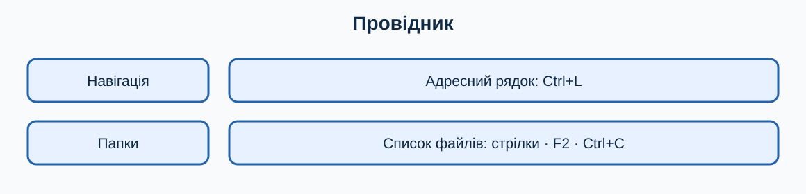

# 6. Файли, папки та Провідник

[← Попередній розділ](./05-windows-desktops.md) · [До змісту](../readme.md) · [Наступний розділ →](./07-built-in-apps.md)

> **Клавіатура перш за все:** спробуйте виконувати повторювані кроки клавішами. Миша залишається корисною для візуальних дій, але клавіатурна команда зазвичай потребує менше рухів і не вимагає точного наведення.

## Адреса, навігація і вибір

Відкрийте Провідник через `Win+E`. `Ctrl+L` або `Alt+D` переводить курсор в адресний рядок. `Alt+←` повертає назад, `Alt+→` — вперед, `Alt+↑` — до батьківської папки. `Ctrl+F` або `F3` переходить у пошук поточної папки.

Стрілки рухаються списком. `Ctrl+Space` додає або прибирає окремий елемент із вибору; `Shift` разом зі стрілками виділяє діапазон. `Ctrl+A` вибирає все — перед видаленням завжди перевіряйте кількість вибраних файлів.

## Створення, перейменування, копіювання

`Ctrl+Shift+N` створює папку, `F2` перейменовує, `Ctrl+C` копіює, `Ctrl+X` вирізує, `Ctrl+V` вставляє. Копіювання залишає оригінал, переміщення змінює його місце. Після важливого перенесення відкрийте нове місце та перевірте файл.

## Розширення та типи файлів

Розширення після крапки (`.pdf`, `.jpg`, `.docx`) підказує тип. Увімкніть показ розширень у Провіднику через **Переглянути → Показати → Розширення імен файлів**. Не змінюйте розширення простим перейменуванням: це не перетворює формат.

## Видалення і Кошик

`Delete` зазвичай переміщує до Кошика; `Shift+Delete` може видалити без звичайного відновлення, тому новачкам не варто користуватися цією комбінацією. У Кошику перевірте ім’я та початкове розташування перед відновленням. Резервна копія потрібна ще до помилки, а не після неї.

## Стиснені архіви

ZIP-архів схожий на контейнер. Для звичайної роботи спершу виберіть **Видобути все**, оберіть папку і лише тоді редагуйте документи. Не запускайте невідомі вкладення або програми з архівів.

## Навчальна майстерня: десять коротких занять

Кожне заняття виконуйте окремо. Спочатку прочитайте весь опис, потім працюйте на тестових даних. Після виконання повторіть дію клавіатурою ще двічі: повторення перетворює комбінацію на звичку й зменшує потребу шукати кнопки мишею.

### Заняття 1. Як відкрити Провідник

**Підготовка.** Збережіть відкриті документи через `Ctrl+S` і переконайтеся, що активне правильне вікно. Якщо вправа стосується файлів, використовуйте лише спеціально створені копії. Подивіться, де зараз фокус: клавіатурна команда діє саме на активний елемент.

**Виконання.** Спробуйте відкрити Провідник. Спочатку виконайте шлях, описаний у цьому розділі, не торкаючись миші. Якщо фокус загубився, натискайте `Tab` або `Shift+Tab`; стрілки змінюють вибір, `Enter` підтверджує, а `Esc` безпечно закриває більшість меню. Не підтверджуйте дію, наслідків якої не розумієте.

**Спостереження.** Порахуйте кроки: одна комбінація часто замінює пошук піктограми, наведення та клацання. Запишіть комбінацію і ситуацію, де вона справді корисна. Якщо миша в цьому завданні зручніша, також запишіть чому: мета — свідомо обирати найефективніший інструмент, а не відмовитися від миші за будь-яку ціну.

- [ ] Дію виконано на безпечних даних.
- [ ] Результат перевірено.
- [ ] Я можу повторити дію клавіатурою.

### Заняття 2. Як перейти в адресний рядок

**Підготовка.** Збережіть відкриті документи через `Ctrl+S` і переконайтеся, що активне правильне вікно. Якщо вправа стосується файлів, використовуйте лише спеціально створені копії. Подивіться, де зараз фокус: клавіатурна команда діє саме на активний елемент.

**Виконання.** Спробуйте перейти в адресний рядок. Спочатку виконайте шлях, описаний у цьому розділі, не торкаючись миші. Якщо фокус загубився, натискайте `Tab` або `Shift+Tab`; стрілки змінюють вибір, `Enter` підтверджує, а `Esc` безпечно закриває більшість меню. Не підтверджуйте дію, наслідків якої не розумієте.

**Спостереження.** Порахуйте кроки: одна комбінація часто замінює пошук піктограми, наведення та клацання. Запишіть комбінацію і ситуацію, де вона справді корисна. Якщо миша в цьому завданні зручніша, також запишіть чому: мета — свідомо обирати найефективніший інструмент, а не відмовитися від миші за будь-яку ціну.

- [ ] Дію виконано на безпечних даних.
- [ ] Результат перевірено.
- [ ] Я можу повторити дію клавіатурою.

### Заняття 3. Як створити папку

**Підготовка.** Збережіть відкриті документи через `Ctrl+S` і переконайтеся, що активне правильне вікно. Якщо вправа стосується файлів, використовуйте лише спеціально створені копії. Подивіться, де зараз фокус: клавіатурна команда діє саме на активний елемент.

**Виконання.** Спробуйте створити папку. Спочатку виконайте шлях, описаний у цьому розділі, не торкаючись миші. Якщо фокус загубився, натискайте `Tab` або `Shift+Tab`; стрілки змінюють вибір, `Enter` підтверджує, а `Esc` безпечно закриває більшість меню. Не підтверджуйте дію, наслідків якої не розумієте.

**Спостереження.** Порахуйте кроки: одна комбінація часто замінює пошук піктограми, наведення та клацання. Запишіть комбінацію і ситуацію, де вона справді корисна. Якщо миша в цьому завданні зручніша, також запишіть чому: мета — свідомо обирати найефективніший інструмент, а не відмовитися від миші за будь-яку ціну.

- [ ] Дію виконано на безпечних даних.
- [ ] Результат перевірено.
- [ ] Я можу повторити дію клавіатурою.

### Заняття 4. Як перейменувати тестовий файл

**Підготовка.** Збережіть відкриті документи через `Ctrl+S` і переконайтеся, що активне правильне вікно. Якщо вправа стосується файлів, використовуйте лише спеціально створені копії. Подивіться, де зараз фокус: клавіатурна команда діє саме на активний елемент.

**Виконання.** Спробуйте перейменувати тестовий файл. Спочатку виконайте шлях, описаний у цьому розділі, не торкаючись миші. Якщо фокус загубився, натискайте `Tab` або `Shift+Tab`; стрілки змінюють вибір, `Enter` підтверджує, а `Esc` безпечно закриває більшість меню. Не підтверджуйте дію, наслідків якої не розумієте.

**Спостереження.** Порахуйте кроки: одна комбінація часто замінює пошук піктограми, наведення та клацання. Запишіть комбінацію і ситуацію, де вона справді корисна. Якщо миша в цьому завданні зручніша, також запишіть чому: мета — свідомо обирати найефективніший інструмент, а не відмовитися від миші за будь-яку ціну.

- [ ] Дію виконано на безпечних даних.
- [ ] Результат перевірено.
- [ ] Я можу повторити дію клавіатурою.

### Заняття 5. Як скопіювати файл

**Підготовка.** Збережіть відкриті документи через `Ctrl+S` і переконайтеся, що активне правильне вікно. Якщо вправа стосується файлів, використовуйте лише спеціально створені копії. Подивіться, де зараз фокус: клавіатурна команда діє саме на активний елемент.

**Виконання.** Спробуйте скопіювати файл. Спочатку виконайте шлях, описаний у цьому розділі, не торкаючись миші. Якщо фокус загубився, натискайте `Tab` або `Shift+Tab`; стрілки змінюють вибір, `Enter` підтверджує, а `Esc` безпечно закриває більшість меню. Не підтверджуйте дію, наслідків якої не розумієте.

**Спостереження.** Порахуйте кроки: одна комбінація часто замінює пошук піктограми, наведення та клацання. Запишіть комбінацію і ситуацію, де вона справді корисна. Якщо миша в цьому завданні зручніша, також запишіть чому: мета — свідомо обирати найефективніший інструмент, а не відмовитися від миші за будь-яку ціну.

- [ ] Дію виконано на безпечних даних.
- [ ] Результат перевірено.
- [ ] Я можу повторити дію клавіатурою.

### Заняття 6. Як перемістити файл

**Підготовка.** Збережіть відкриті документи через `Ctrl+S` і переконайтеся, що активне правильне вікно. Якщо вправа стосується файлів, використовуйте лише спеціально створені копії. Подивіться, де зараз фокус: клавіатурна команда діє саме на активний елемент.

**Виконання.** Спробуйте перемістити файл. Спочатку виконайте шлях, описаний у цьому розділі, не торкаючись миші. Якщо фокус загубився, натискайте `Tab` або `Shift+Tab`; стрілки змінюють вибір, `Enter` підтверджує, а `Esc` безпечно закриває більшість меню. Не підтверджуйте дію, наслідків якої не розумієте.

**Спостереження.** Порахуйте кроки: одна комбінація часто замінює пошук піктограми, наведення та клацання. Запишіть комбінацію і ситуацію, де вона справді корисна. Якщо миша в цьому завданні зручніша, також запишіть чому: мета — свідомо обирати найефективніший інструмент, а не відмовитися від миші за будь-яку ціну.

- [ ] Дію виконано на безпечних даних.
- [ ] Результат перевірено.
- [ ] Я можу повторити дію клавіатурою.

### Заняття 7. Як виділити діапазон

**Підготовка.** Збережіть відкриті документи через `Ctrl+S` і переконайтеся, що активне правильне вікно. Якщо вправа стосується файлів, використовуйте лише спеціально створені копії. Подивіться, де зараз фокус: клавіатурна команда діє саме на активний елемент.

**Виконання.** Спробуйте виділити діапазон. Спочатку виконайте шлях, описаний у цьому розділі, не торкаючись миші. Якщо фокус загубився, натискайте `Tab` або `Shift+Tab`; стрілки змінюють вибір, `Enter` підтверджує, а `Esc` безпечно закриває більшість меню. Не підтверджуйте дію, наслідків якої не розумієте.

**Спостереження.** Порахуйте кроки: одна комбінація часто замінює пошук піктограми, наведення та клацання. Запишіть комбінацію і ситуацію, де вона справді корисна. Якщо миша в цьому завданні зручніша, також запишіть чому: мета — свідомо обирати найефективніший інструмент, а не відмовитися від миші за будь-яку ціну.

- [ ] Дію виконано на безпечних даних.
- [ ] Результат перевірено.
- [ ] Я можу повторити дію клавіатурою.

### Заняття 8. Як увімкнути показ розширень

**Підготовка.** Збережіть відкриті документи через `Ctrl+S` і переконайтеся, що активне правильне вікно. Якщо вправа стосується файлів, використовуйте лише спеціально створені копії. Подивіться, де зараз фокус: клавіатурна команда діє саме на активний елемент.

**Виконання.** Спробуйте увімкнути показ розширень. Спочатку виконайте шлях, описаний у цьому розділі, не торкаючись миші. Якщо фокус загубився, натискайте `Tab` або `Shift+Tab`; стрілки змінюють вибір, `Enter` підтверджує, а `Esc` безпечно закриває більшість меню. Не підтверджуйте дію, наслідків якої не розумієте.

**Спостереження.** Порахуйте кроки: одна комбінація часто замінює пошук піктограми, наведення та клацання. Запишіть комбінацію і ситуацію, де вона справді корисна. Якщо миша в цьому завданні зручніша, також запишіть чому: мета — свідомо обирати найефективніший інструмент, а не відмовитися від миші за будь-яку ціну.

- [ ] Дію виконано на безпечних даних.
- [ ] Результат перевірено.
- [ ] Я можу повторити дію клавіатурою.

### Заняття 9. Як відновити файл із Кошика

**Підготовка.** Збережіть відкриті документи через `Ctrl+S` і переконайтеся, що активне правильне вікно. Якщо вправа стосується файлів, використовуйте лише спеціально створені копії. Подивіться, де зараз фокус: клавіатурна команда діє саме на активний елемент.

**Виконання.** Спробуйте відновити файл із Кошика. Спочатку виконайте шлях, описаний у цьому розділі, не торкаючись миші. Якщо фокус загубився, натискайте `Tab` або `Shift+Tab`; стрілки змінюють вибір, `Enter` підтверджує, а `Esc` безпечно закриває більшість меню. Не підтверджуйте дію, наслідків якої не розумієте.

**Спостереження.** Порахуйте кроки: одна комбінація часто замінює пошук піктограми, наведення та клацання. Запишіть комбінацію і ситуацію, де вона справді корисна. Якщо миша в цьому завданні зручніша, також запишіть чому: мета — свідомо обирати найефективніший інструмент, а не відмовитися від миші за будь-яку ціну.

- [ ] Дію виконано на безпечних даних.
- [ ] Результат перевірено.
- [ ] Я можу повторити дію клавіатурою.

### Заняття 10. Як видобути тестовий ZIP-архів

**Підготовка.** Збережіть відкриті документи через `Ctrl+S` і переконайтеся, що активне правильне вікно. Якщо вправа стосується файлів, використовуйте лише спеціально створені копії. Подивіться, де зараз фокус: клавіатурна команда діє саме на активний елемент.

**Виконання.** Спробуйте видобути тестовий ZIP-архів. Спочатку виконайте шлях, описаний у цьому розділі, не торкаючись миші. Якщо фокус загубився, натискайте `Tab` або `Shift+Tab`; стрілки змінюють вибір, `Enter` підтверджує, а `Esc` безпечно закриває більшість меню. Не підтверджуйте дію, наслідків якої не розумієте.

**Спостереження.** Порахуйте кроки: одна комбінація часто замінює пошук піктограми, наведення та клацання. Запишіть комбінацію і ситуацію, де вона справді корисна. Якщо миша в цьому завданні зручніша, також запишіть чому: мета — свідомо обирати найефективніший інструмент, а не відмовитися від миші за будь-яку ціну.

- [ ] Дію виконано на безпечних даних.
- [ ] Результат перевірено.
- [ ] Я можу повторити дію клавіатурою.

## Запитання для повторення й обговорення

### 1. Яка частина цієї дії потребує найбільше уваги?

Сформулюйте відповідь власними словами й наведіть один побутовий приклад. Корисна відповідь має назвати активне вікно або вибраний об’єкт, потрібну клавіатурну команду, очікуваний результат і спосіб безпечної перевірки. Для ризикованої операції обов’язково додайте резервну копію або можливість скасування. Не оцінюйте швидкість лише за першу спробу: порівнюйте способи після кількох повторень.

### 2. Що зміниться, якщо фокус перебуває не в тому вікні?

Сформулюйте відповідь власними словами й наведіть один побутовий приклад. Корисна відповідь має назвати активне вікно або вибраний об’єкт, потрібну клавіатурну команду, очікуваний результат і спосіб безпечної перевірки. Для ризикованої операції обов’язково додайте резервну копію або можливість скасування. Не оцінюйте швидкість лише за першу спробу: порівнюйте способи після кількох повторень.

### 3. Яку команду слід запам’ятати першою?

Сформулюйте відповідь власними словами й наведіть один побутовий приклад. Корисна відповідь має назвати активне вікно або вибраний об’єкт, потрібну клавіатурну команду, очікуваний результат і спосіб безпечної перевірки. Для ризикованої операції обов’язково додайте резервну копію або можливість скасування. Не оцінюйте швидкість лише за першу спробу: порівнюйте способи після кількох повторень.

### 4. Коли миша все ж буде зручнішою?

Сформулюйте відповідь власними словами й наведіть один побутовий приклад. Корисна відповідь має назвати активне вікно або вибраний об’єкт, потрібну клавіатурну команду, очікуваний результат і спосіб безпечної перевірки. Для ризикованої операції обов’язково додайте резервну копію або можливість скасування. Не оцінюйте швидкість лише за першу спробу: порівнюйте способи після кількох повторень.

### 5. Як безпечно виправити помилкову дію?

Сформулюйте відповідь власними словами й наведіть один побутовий приклад. Корисна відповідь має назвати активне вікно або вибраний об’єкт, потрібну клавіатурну команду, очікуваний результат і спосіб безпечної перевірки. Для ризикованої операції обов’язково додайте резервну копію або можливість скасування. Не оцінюйте швидкість лише за першу спробу: порівнюйте способи після кількох повторень.

### 6. Як пояснити цей матеріал іншій людині?

Сформулюйте відповідь власними словами й наведіть один побутовий приклад. Корисна відповідь має назвати активне вікно або вибраний об’єкт, потрібну клавіатурну команду, очікуваний результат і спосіб безпечної перевірки. Для ризикованої операції обов’язково додайте резервну копію або можливість скасування. Не оцінюйте швидкість лише за першу спробу: порівнюйте способи після кількох повторень.

## Практична вправа

Створіть структуру `Навчання/Документи/Копії`, перейменуйте папку через `F2` і скопіюйте туди тестовий файл.

## Самоперевірка

- [ ] Я виконав вправу на тестових даних.
- [ ] Я використав щонайменше дві команди клавіатури.
- [ ] Я можу пояснити дію іншій людині.
- [ ] Я не змінював незрозумілі або небезпечні параметри.

## Короткий тест

### 1. Яка команда відкриває Провідник?

- `Win+E`
- `Win+F`
- `Ctrl+E`

Показати відповідь

`Win+E` відкриває Провідник.

### 2. Навіщо потрібен `Esc`?

- Скасувати або закрити поточний елемент
- Назавжди видалити систему
- Збільшити звук

Показати відповідь

`Esc` зазвичай закриває меню, діалог або скасовує поточну операцію.

---

[← Попередній розділ](./05-windows-desktops.md) · [До змісту](../readme.md) · [Наступний розділ →](./07-built-in-apps.md)
