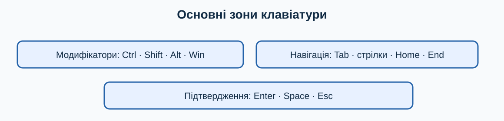

# 1. Знайомство з Windows 11

[← Попередній розділ](../README.md) · [До змісту](../README.md) · [Наступний розділ →](./02-desktop-start-taskbar.md)

> **Клавіатура перш за все:** спробуйте виконувати повторювані кроки клавішами. Миша залишається корисною для візуальних дій, але клавіатурна команда зазвичай потребує менше рухів і не вимагає точного наведення.

Ця книжка призначена для людини, яка користується комп’ютером удома або на роботі, але не займається програмуванням. У ній немає вимоги запам’ятати все одразу. Читайте по одному розділу, повторюйте дії та відмічайте виконані вправи.

> **Головна ідея книжки:** клавіатура часто швидша за мишу. Команда з двох клавіш виконується одразу, тоді як мишею треба знайти елемент, навести вказівник і клацнути. Найбільший виграш помітний у діях, які повторюються десятки разів на день.

## Як читати позначення клавіш

Запис `Ctrl+C` означає: утримуйте `Ctrl`, один раз натисніть `C`, а потім відпустіть обидві клавіші. Знак `+` натискати не потрібно. Запис `Win`, або клавіша Windows, означає клавішу з емблемою Windows. Якщо комбінація містить три клавіші, наприклад `Ctrl+Shift+Esc`, спочатку затисніть перші дві, тоді натисніть третю.

## Безпечне навчання

Працюйте з навчальною папкою та копіями файлів. Перед видаленням, скиданням системи, зміною облікового запису або шифруванням зробіть резервну копію. Якщо текст кнопки незрозумілий, не натискайте її навмання: натисніть `Esc`, прочитайте пояснення або зверніться по допомогу.

## Чотири звички ефективного користувача

1. Натискайте `Win` і вводьте назву програми замість пошуку піктограми мишею.
2. Перемикайтеся між програмами через `Alt+Tab`.
3. У тексті користуйтеся `Ctrl+C`, `Ctrl+V`, `Ctrl+Z`, `Ctrl+F` і `Ctrl+S`.
4. Перш ніж повторювати довгу дію мишею, перевірте, чи є для неї команда клавіатури.

## Відмінності між комп’ютерами

Windows 11 регулярно оновлюється, тому назви або розташування пунктів можуть трохи відрізнятися. На ноутбуці функціональні клавіші `F1`–`F12` іноді працюють разом із `Fn`. Розкладка літер не змінює фізичне розташування більшості системних комбінацій, але для команд із літерами зручно тимчасово перейти на англійську розкладку.

## Навчальна майстерня: десять коротких занять

Кожне заняття виконуйте окремо. Спочатку прочитайте весь опис, потім працюйте на тестових даних. Після виконання повторіть дію клавіатурою ще двічі: повторення перетворює комбінацію на звичку й зменшує потребу шукати кнопки мишею.

### Заняття 1. Як відкрити меню «Пуск» клавішею Win

**Підготовка.** Збережіть відкриті документи через `Ctrl+S` і переконайтеся, що активне правильне вікно. Якщо вправа стосується файлів, використовуйте лише спеціально створені копії. Подивіться, де зараз фокус: клавіатурна команда діє саме на активний елемент.

**Виконання.** Спробуйте відкрити меню «Пуск» клавішею Win. Спочатку виконайте шлях, описаний у цьому розділі, не торкаючись миші. Якщо фокус загубився, натискайте `Tab` або `Shift+Tab`; стрілки змінюють вибір, `Enter` підтверджує, а `Esc` безпечно закриває більшість меню. Не підтверджуйте дію, наслідків якої не розумієте.

**Спостереження.** Порахуйте кроки: одна комбінація часто замінює пошук піктограми, наведення та клацання. Запишіть комбінацію і ситуацію, де вона справді корисна. Якщо миша в цьому завданні зручніша, також запишіть чому: мета — свідомо обирати найефективніший інструмент, а не відмовитися від миші за будь-яку ціну.

- [ ] Дію виконано на безпечних даних.
- [ ] Результат перевірено.
- [ ] Я можу повторити дію клавіатурою.

### Заняття 2. Як прочитати запис комбінації клавіш

**Підготовка.** Збережіть відкриті документи через `Ctrl+S` і переконайтеся, що активне правильне вікно. Якщо вправа стосується файлів, використовуйте лише спеціально створені копії. Подивіться, де зараз фокус: клавіатурна команда діє саме на активний елемент.

**Виконання.** Спробуйте прочитати запис комбінації клавіш. Спочатку виконайте шлях, описаний у цьому розділі, не торкаючись миші. Якщо фокус загубився, натискайте `Tab` або `Shift+Tab`; стрілки змінюють вибір, `Enter` підтверджує, а `Esc` безпечно закриває більшість меню. Не підтверджуйте дію, наслідків якої не розумієте.

**Спостереження.** Порахуйте кроки: одна комбінація часто замінює пошук піктограми, наведення та клацання. Запишіть комбінацію і ситуацію, де вона справді корисна. Якщо миша в цьому завданні зручніша, також запишіть чому: мета — свідомо обирати найефективніший інструмент, а не відмовитися від миші за будь-яку ціну.

- [ ] Дію виконано на безпечних даних.
- [ ] Результат перевірено.
- [ ] Я можу повторити дію клавіатурою.

### Заняття 3. Як створити навчальну папку

**Підготовка.** Збережіть відкриті документи через `Ctrl+S` і переконайтеся, що активне правильне вікно. Якщо вправа стосується файлів, використовуйте лише спеціально створені копії. Подивіться, де зараз фокус: клавіатурна команда діє саме на активний елемент.

**Виконання.** Спробуйте створити навчальну папку. Спочатку виконайте шлях, описаний у цьому розділі, не торкаючись миші. Якщо фокус загубився, натискайте `Tab` або `Shift+Tab`; стрілки змінюють вибір, `Enter` підтверджує, а `Esc` безпечно закриває більшість меню. Не підтверджуйте дію, наслідків якої не розумієте.

**Спостереження.** Порахуйте кроки: одна комбінація часто замінює пошук піктограми, наведення та клацання. Запишіть комбінацію і ситуацію, де вона справді корисна. Якщо миша в цьому завданні зручніша, також запишіть чому: мета — свідомо обирати найефективніший інструмент, а не відмовитися від миші за будь-яку ціну.

- [ ] Дію виконано на безпечних даних.
- [ ] Результат перевірено.
- [ ] Я можу повторити дію клавіатурою.

### Заняття 4. Як запустити Блокнот через пошук

**Підготовка.** Збережіть відкриті документи через `Ctrl+S` і переконайтеся, що активне правильне вікно. Якщо вправа стосується файлів, використовуйте лише спеціально створені копії. Подивіться, де зараз фокус: клавіатурна команда діє саме на активний елемент.

**Виконання.** Спробуйте запустити Блокнот через пошук. Спочатку виконайте шлях, описаний у цьому розділі, не торкаючись миші. Якщо фокус загубився, натискайте `Tab` або `Shift+Tab`; стрілки змінюють вибір, `Enter` підтверджує, а `Esc` безпечно закриває більшість меню. Не підтверджуйте дію, наслідків якої не розумієте.

**Спостереження.** Порахуйте кроки: одна комбінація часто замінює пошук піктограми, наведення та клацання. Запишіть комбінацію і ситуацію, де вона справді корисна. Якщо миша в цьому завданні зручніша, також запишіть чому: мета — свідомо обирати найефективніший інструмент, а не відмовитися від миші за будь-яку ціну.

- [ ] Дію виконано на безпечних даних.
- [ ] Результат перевірено.
- [ ] Я можу повторити дію клавіатурою.

### Заняття 5. Як зберегти тренувальний документ

**Підготовка.** Збережіть відкриті документи через `Ctrl+S` і переконайтеся, що активне правильне вікно. Якщо вправа стосується файлів, використовуйте лише спеціально створені копії. Подивіться, де зараз фокус: клавіатурна команда діє саме на активний елемент.

**Виконання.** Спробуйте зберегти тренувальний документ. Спочатку виконайте шлях, описаний у цьому розділі, не торкаючись миші. Якщо фокус загубився, натискайте `Tab` або `Shift+Tab`; стрілки змінюють вибір, `Enter` підтверджує, а `Esc` безпечно закриває більшість меню. Не підтверджуйте дію, наслідків якої не розумієте.

**Спостереження.** Порахуйте кроки: одна комбінація часто замінює пошук піктограми, наведення та клацання. Запишіть комбінацію і ситуацію, де вона справді корисна. Якщо миша в цьому завданні зручніша, також запишіть чому: мета — свідомо обирати найефективніший інструмент, а не відмовитися від миші за будь-яку ціну.

- [ ] Дію виконано на безпечних даних.
- [ ] Результат перевірено.
- [ ] Я можу повторити дію клавіатурою.

### Заняття 6. Як скасувати помилкову зміну

**Підготовка.** Збережіть відкриті документи через `Ctrl+S` і переконайтеся, що активне правильне вікно. Якщо вправа стосується файлів, використовуйте лише спеціально створені копії. Подивіться, де зараз фокус: клавіатурна команда діє саме на активний елемент.

**Виконання.** Спробуйте скасувати помилкову зміну. Спочатку виконайте шлях, описаний у цьому розділі, не торкаючись миші. Якщо фокус загубився, натискайте `Tab` або `Shift+Tab`; стрілки змінюють вибір, `Enter` підтверджує, а `Esc` безпечно закриває більшість меню. Не підтверджуйте дію, наслідків якої не розумієте.

**Спостереження.** Порахуйте кроки: одна комбінація часто замінює пошук піктограми, наведення та клацання. Запишіть комбінацію і ситуацію, де вона справді корисна. Якщо миша в цьому завданні зручніша, також запишіть чому: мета — свідомо обирати найефективніший інструмент, а не відмовитися від миші за будь-яку ціну.

- [ ] Дію виконано на безпечних даних.
- [ ] Результат перевірено.
- [ ] Я можу повторити дію клавіатурою.

### Заняття 7. Як перемкнутися між двома програмами

**Підготовка.** Збережіть відкриті документи через `Ctrl+S` і переконайтеся, що активне правильне вікно. Якщо вправа стосується файлів, використовуйте лише спеціально створені копії. Подивіться, де зараз фокус: клавіатурна команда діє саме на активний елемент.

**Виконання.** Спробуйте перемкнутися між двома програмами. Спочатку виконайте шлях, описаний у цьому розділі, не торкаючись миші. Якщо фокус загубився, натискайте `Tab` або `Shift+Tab`; стрілки змінюють вибір, `Enter` підтверджує, а `Esc` безпечно закриває більшість меню. Не підтверджуйте дію, наслідків якої не розумієте.

**Спостереження.** Порахуйте кроки: одна комбінація часто замінює пошук піктограми, наведення та клацання. Запишіть комбінацію і ситуацію, де вона справді корисна. Якщо миша в цьому завданні зручніша, також запишіть чому: мета — свідомо обирати найефективніший інструмент, а не відмовитися від миші за будь-яку ціну.

- [ ] Дію виконано на безпечних даних.
- [ ] Результат перевірено.
- [ ] Я можу повторити дію клавіатурою.

### Заняття 8. Як заблокувати сеанс

**Підготовка.** Збережіть відкриті документи через `Ctrl+S` і переконайтеся, що активне правильне вікно. Якщо вправа стосується файлів, використовуйте лише спеціально створені копії. Подивіться, де зараз фокус: клавіатурна команда діє саме на активний елемент.

**Виконання.** Спробуйте заблокувати сеанс. Спочатку виконайте шлях, описаний у цьому розділі, не торкаючись миші. Якщо фокус загубився, натискайте `Tab` або `Shift+Tab`; стрілки змінюють вибір, `Enter` підтверджує, а `Esc` безпечно закриває більшість меню. Не підтверджуйте дію, наслідків якої не розумієте.

**Спостереження.** Порахуйте кроки: одна комбінація часто замінює пошук піктограми, наведення та клацання. Запишіть комбінацію і ситуацію, де вона справді корисна. Якщо миша в цьому завданні зручніша, також запишіть чому: мета — свідомо обирати найефективніший інструмент, а не відмовитися від миші за будь-яку ціну.

- [ ] Дію виконано на безпечних даних.
- [ ] Результат перевірено.
- [ ] Я можу повторити дію клавіатурою.

### Заняття 9. Як повернутися до змісту книжки

**Підготовка.** Збережіть відкриті документи через `Ctrl+S` і переконайтеся, що активне правильне вікно. Якщо вправа стосується файлів, використовуйте лише спеціально створені копії. Подивіться, де зараз фокус: клавіатурна команда діє саме на активний елемент.

**Виконання.** Спробуйте повернутися до змісту книжки. Спочатку виконайте шлях, описаний у цьому розділі, не торкаючись миші. Якщо фокус загубився, натискайте `Tab` або `Shift+Tab`; стрілки змінюють вибір, `Enter` підтверджує, а `Esc` безпечно закриває більшість меню. Не підтверджуйте дію, наслідків якої не розумієте.

**Спостереження.** Порахуйте кроки: одна комбінація часто замінює пошук піктограми, наведення та клацання. Запишіть комбінацію і ситуацію, де вона справді корисна. Якщо миша в цьому завданні зручніша, також запишіть чому: мета — свідомо обирати найефективніший інструмент, а не відмовитися від миші за будь-яку ціну.

- [ ] Дію виконано на безпечних даних.
- [ ] Результат перевірено.
- [ ] Я можу повторити дію клавіатурою.

### Заняття 10. Як підготувати безпечні тестові дані

**Підготовка.** Збережіть відкриті документи через `Ctrl+S` і переконайтеся, що активне правильне вікно. Якщо вправа стосується файлів, використовуйте лише спеціально створені копії. Подивіться, де зараз фокус: клавіатурна команда діє саме на активний елемент.

**Виконання.** Спробуйте підготувати безпечні тестові дані. Спочатку виконайте шлях, описаний у цьому розділі, не торкаючись миші. Якщо фокус загубився, натискайте `Tab` або `Shift+Tab`; стрілки змінюють вибір, `Enter` підтверджує, а `Esc` безпечно закриває більшість меню. Не підтверджуйте дію, наслідків якої не розумієте.

**Спостереження.** Порахуйте кроки: одна комбінація часто замінює пошук піктограми, наведення та клацання. Запишіть комбінацію і ситуацію, де вона справді корисна. Якщо миша в цьому завданні зручніша, також запишіть чому: мета — свідомо обирати найефективніший інструмент, а не відмовитися від миші за будь-яку ціну.

- [ ] Дію виконано на безпечних даних.
- [ ] Результат перевірено.
- [ ] Я можу повторити дію клавіатурою.

## Запитання для повторення й обговорення

### 1. Яка частина цієї дії потребує найбільше уваги?

Сформулюйте відповідь власними словами й наведіть один побутовий приклад. Корисна відповідь має назвати активне вікно або вибраний об’єкт, потрібну клавіатурну команду, очікуваний результат і спосіб безпечної перевірки. Для ризикованої операції обов’язково додайте резервну копію або можливість скасування. Не оцінюйте швидкість лише за першу спробу: порівнюйте способи після кількох повторень.

### 2. Що зміниться, якщо фокус перебуває не в тому вікні?

Сформулюйте відповідь власними словами й наведіть один побутовий приклад. Корисна відповідь має назвати активне вікно або вибраний об’єкт, потрібну клавіатурну команду, очікуваний результат і спосіб безпечної перевірки. Для ризикованої операції обов’язково додайте резервну копію або можливість скасування. Не оцінюйте швидкість лише за першу спробу: порівнюйте способи після кількох повторень.

### 3. Яку команду слід запам’ятати першою?

Сформулюйте відповідь власними словами й наведіть один побутовий приклад. Корисна відповідь має назвати активне вікно або вибраний об’єкт, потрібну клавіатурну команду, очікуваний результат і спосіб безпечної перевірки. Для ризикованої операції обов’язково додайте резервну копію або можливість скасування. Не оцінюйте швидкість лише за першу спробу: порівнюйте способи після кількох повторень.

### 4. Коли миша все ж буде зручнішою?

Сформулюйте відповідь власними словами й наведіть один побутовий приклад. Корисна відповідь має назвати активне вікно або вибраний об’єкт, потрібну клавіатурну команду, очікуваний результат і спосіб безпечної перевірки. Для ризикованої операції обов’язково додайте резервну копію або можливість скасування. Не оцінюйте швидкість лише за першу спробу: порівнюйте способи після кількох повторень.

### 5. Як безпечно виправити помилкову дію?

Сформулюйте відповідь власними словами й наведіть один побутовий приклад. Корисна відповідь має назвати активне вікно або вибраний об’єкт, потрібну клавіатурну команду, очікуваний результат і спосіб безпечної перевірки. Для ризикованої операції обов’язково додайте резервну копію або можливість скасування. Не оцінюйте швидкість лише за першу спробу: порівнюйте способи після кількох повторень.

### 6. Як пояснити цей матеріал іншій людині?

Сформулюйте відповідь власними словами й наведіть один побутовий приклад. Корисна відповідь має назвати активне вікно або вибраний об’єкт, потрібну клавіатурну команду, очікуваний результат і спосіб безпечної перевірки. Для ризикованої операції обов’язково додайте резервну копію або можливість скасування. Не оцінюйте швидкість лише за першу спробу: порівнюйте способи після кількох повторень.

## Практична вправа

Створіть папку `Навчання Windows`, відкрийте Блокнот через `Win`, запишіть три цілі, збережіть файл через `Ctrl+S`, а потім заблокуйте комп’ютер через `Win+L`.

## Самоперевірка

- [ ] Я виконав вправу на тестових даних.
- [ ] Я використав щонайменше дві команди клавіатури.
- [ ] Я можу пояснити дію іншій людині.
- [ ] Я не змінював незрозумілі або небезпечні параметри.

## Короткий тест

### 1. Що означає `Ctrl+C`?

- Натиснути знак плюс
- Утримувати Ctrl і натиснути C
- Натиснути клавіші лише одночасно з мишею

Показати відповідь

Утримуйте `Ctrl`, натисніть `C` і відпустіть клавіші.

### 2. Навіщо потрібен `Esc`?

- Скасувати або закрити поточний елемент
- Назавжди видалити систему
- Збільшити звук

Показати відповідь

`Esc` зазвичай закриває меню, діалог або скасовує поточну операцію.

---

[← Попередній розділ](../README.md) · [До змісту](../README.md) · [Наступний розділ →](./02-desktop-start-taskbar.md)
