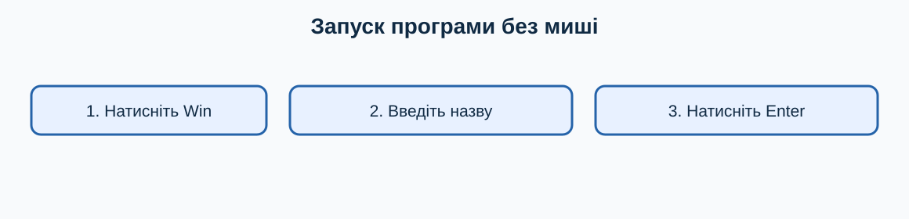

# 2. Робочий стіл, меню «Пуск» і панель завдань

[← Попередній розділ](./01-introduction.md) · [До змісту](../README.md) · [Наступний розділ →](./03-keyboard-first.md)

> **Клавіатура перш за все:** спробуйте виконувати повторювані кроки клавішами. Миша залишається корисною для візуальних дій, але клавіатурна команда зазвичай потребує менше рухів і не вимагає точного наведення.

## Робочий стіл

Робочий стіл — фонова область, яка з’являється після входу. Ярлик лише вказує на програму або файл; видалення ярлика зазвичай не видаляє саму програму. Не зберігайте тут сотні документів: вони ускладнюють пошук і можуть не потрапити до резервної копії.

Натисніть `Win+D`, щоб показати робочий стіл, і повторіть комбінацію, щоб повернути вікна. Це швидше, ніж згортати їх по одному. `Win+,` тимчасово показує стіл, доки клавіші затиснуті.

## Меню «Пуск» без полювання мишею

Натисніть `Win`, почніть вводити «Калькулятор», а потім `Enter`. Так само запускається майже будь-яка встановлена програма, параметр або документ. Стрілки переміщують вибір, `Tab` переходить між областями, `Esc` закриває меню.

## Панель завдань

На панелі завдань видно закріплені та запущені програми. `Win+1` відкриває першу закріплену програму, `Win+2` — другу і так далі. Якщо програма вже працює, команда переходить до її вікна. `Win+T` переводить фокус на панель; далі користуйтеся стрілками та `Enter`.

## Область швидких налаштувань і сповіщення

`Win+A` відкриває швидкі налаштування гучності, мережі та Bluetooth. `Win+N` відкриває сповіщення й календар. Для переходів використовуйте `Tab`, `Shift+Tab`, стрілки, `Space` та `Enter`. Це особливо зручно на ноутбуці, коли руки вже лежать на клавіатурі.

## Контекстне меню

`Shift+F10` відкриває контекстне меню для вибраного елемента — аналог правого клацання. Стрілками виберіть команду, `Enter` виконає її, `Esc` закриє меню. Підкреслена літера в меню часто є клавішею швидкого вибору.

## Навчальна майстерня: десять коротких занять

Кожне заняття виконуйте окремо. Спочатку прочитайте весь опис, потім працюйте на тестових даних. Після виконання повторіть дію клавіатурою ще двічі: повторення перетворює комбінацію на звичку й зменшує потребу шукати кнопки мишею.

### Заняття 1. Як показати й приховати робочий стіл

**Підготовка.** Збережіть відкриті документи через `Ctrl+S` і переконайтеся, що активне правильне вікно. Якщо вправа стосується файлів, використовуйте лише спеціально створені копії. Подивіться, де зараз фокус: клавіатурна команда діє саме на активний елемент.

**Виконання.** Спробуйте показати й приховати робочий стіл. Спочатку виконайте шлях, описаний у цьому розділі, не торкаючись миші. Якщо фокус загубився, натискайте `Tab` або `Shift+Tab`; стрілки змінюють вибір, `Enter` підтверджує, а `Esc` безпечно закриває більшість меню. Не підтверджуйте дію, наслідків якої не розумієте.

**Спостереження.** Порахуйте кроки: одна комбінація часто замінює пошук піктограми, наведення та клацання. Запишіть комбінацію і ситуацію, де вона справді корисна. Якщо миша в цьому завданні зручніша, також запишіть чому: мета — свідомо обирати найефективніший інструмент, а не відмовитися від миші за будь-яку ціну.

- [ ] Дію виконано на безпечних даних.
- [ ] Результат перевірено.
- [ ] Я можу повторити дію клавіатурою.

### Заняття 2. Як запустити програму через Win

**Підготовка.** Збережіть відкриті документи через `Ctrl+S` і переконайтеся, що активне правильне вікно. Якщо вправа стосується файлів, використовуйте лише спеціально створені копії. Подивіться, де зараз фокус: клавіатурна команда діє саме на активний елемент.

**Виконання.** Спробуйте запустити програму через Win. Спочатку виконайте шлях, описаний у цьому розділі, не торкаючись миші. Якщо фокус загубився, натискайте `Tab` або `Shift+Tab`; стрілки змінюють вибір, `Enter` підтверджує, а `Esc` безпечно закриває більшість меню. Не підтверджуйте дію, наслідків якої не розумієте.

**Спостереження.** Порахуйте кроки: одна комбінація часто замінює пошук піктограми, наведення та клацання. Запишіть комбінацію і ситуацію, де вона справді корисна. Якщо миша в цьому завданні зручніша, також запишіть чому: мета — свідомо обирати найефективніший інструмент, а не відмовитися від миші за будь-яку ціну.

- [ ] Дію виконано на безпечних даних.
- [ ] Результат перевірено.
- [ ] Я можу повторити дію клавіатурою.

### Заняття 3. Як перейти панеллю завдань через Win+T

**Підготовка.** Збережіть відкриті документи через `Ctrl+S` і переконайтеся, що активне правильне вікно. Якщо вправа стосується файлів, використовуйте лише спеціально створені копії. Подивіться, де зараз фокус: клавіатурна команда діє саме на активний елемент.

**Виконання.** Спробуйте перейти панеллю завдань через Win+T. Спочатку виконайте шлях, описаний у цьому розділі, не торкаючись миші. Якщо фокус загубився, натискайте `Tab` або `Shift+Tab`; стрілки змінюють вибір, `Enter` підтверджує, а `Esc` безпечно закриває більшість меню. Не підтверджуйте дію, наслідків якої не розумієте.

**Спостереження.** Порахуйте кроки: одна комбінація часто замінює пошук піктограми, наведення та клацання. Запишіть комбінацію і ситуацію, де вона справді корисна. Якщо миша в цьому завданні зручніша, також запишіть чому: мета — свідомо обирати найефективніший інструмент, а не відмовитися від миші за будь-яку ціну.

- [ ] Дію виконано на безпечних даних.
- [ ] Результат перевірено.
- [ ] Я можу повторити дію клавіатурою.

### Заняття 4. Як відкрити швидкі налаштування

**Підготовка.** Збережіть відкриті документи через `Ctrl+S` і переконайтеся, що активне правильне вікно. Якщо вправа стосується файлів, використовуйте лише спеціально створені копії. Подивіться, де зараз фокус: клавіатурна команда діє саме на активний елемент.

**Виконання.** Спробуйте відкрити швидкі налаштування. Спочатку виконайте шлях, описаний у цьому розділі, не торкаючись миші. Якщо фокус загубився, натискайте `Tab` або `Shift+Tab`; стрілки змінюють вибір, `Enter` підтверджує, а `Esc` безпечно закриває більшість меню. Не підтверджуйте дію, наслідків якої не розумієте.

**Спостереження.** Порахуйте кроки: одна комбінація часто замінює пошук піктограми, наведення та клацання. Запишіть комбінацію і ситуацію, де вона справді корисна. Якщо миша в цьому завданні зручніша, також запишіть чому: мета — свідомо обирати найефективніший інструмент, а не відмовитися від миші за будь-яку ціну.

- [ ] Дію виконано на безпечних даних.
- [ ] Результат перевірено.
- [ ] Я можу повторити дію клавіатурою.

### Заняття 5. Як відкрити сповіщення

**Підготовка.** Збережіть відкриті документи через `Ctrl+S` і переконайтеся, що активне правильне вікно. Якщо вправа стосується файлів, використовуйте лише спеціально створені копії. Подивіться, де зараз фокус: клавіатурна команда діє саме на активний елемент.

**Виконання.** Спробуйте відкрити сповіщення. Спочатку виконайте шлях, описаний у цьому розділі, не торкаючись миші. Якщо фокус загубився, натискайте `Tab` або `Shift+Tab`; стрілки змінюють вибір, `Enter` підтверджує, а `Esc` безпечно закриває більшість меню. Не підтверджуйте дію, наслідків якої не розумієте.

**Спостереження.** Порахуйте кроки: одна комбінація часто замінює пошук піктограми, наведення та клацання. Запишіть комбінацію і ситуацію, де вона справді корисна. Якщо миша в цьому завданні зручніша, також запишіть чому: мета — свідомо обирати найефективніший інструмент, а не відмовитися від миші за будь-яку ціну.

- [ ] Дію виконано на безпечних даних.
- [ ] Результат перевірено.
- [ ] Я можу повторити дію клавіатурою.

### Заняття 6. Як викликати контекстне меню

**Підготовка.** Збережіть відкриті документи через `Ctrl+S` і переконайтеся, що активне правильне вікно. Якщо вправа стосується файлів, використовуйте лише спеціально створені копії. Подивіться, де зараз фокус: клавіатурна команда діє саме на активний елемент.

**Виконання.** Спробуйте викликати контекстне меню. Спочатку виконайте шлях, описаний у цьому розділі, не торкаючись миші. Якщо фокус загубився, натискайте `Tab` або `Shift+Tab`; стрілки змінюють вибір, `Enter` підтверджує, а `Esc` безпечно закриває більшість меню. Не підтверджуйте дію, наслідків якої не розумієте.

**Спостереження.** Порахуйте кроки: одна комбінація часто замінює пошук піктограми, наведення та клацання. Запишіть комбінацію і ситуацію, де вона справді корисна. Якщо миша в цьому завданні зручніша, також запишіть чому: мета — свідомо обирати найефективніший інструмент, а не відмовитися від миші за будь-яку ціну.

- [ ] Дію виконано на безпечних даних.
- [ ] Результат перевірено.
- [ ] Я можу повторити дію клавіатурою.

### Заняття 7. Як закрити меню клавішею Esc

**Підготовка.** Збережіть відкриті документи через `Ctrl+S` і переконайтеся, що активне правильне вікно. Якщо вправа стосується файлів, використовуйте лише спеціально створені копії. Подивіться, де зараз фокус: клавіатурна команда діє саме на активний елемент.

**Виконання.** Спробуйте закрити меню клавішею Esc. Спочатку виконайте шлях, описаний у цьому розділі, не торкаючись миші. Якщо фокус загубився, натискайте `Tab` або `Shift+Tab`; стрілки змінюють вибір, `Enter` підтверджує, а `Esc` безпечно закриває більшість меню. Не підтверджуйте дію, наслідків якої не розумієте.

**Спостереження.** Порахуйте кроки: одна комбінація часто замінює пошук піктограми, наведення та клацання. Запишіть комбінацію і ситуацію, де вона справді корисна. Якщо миша в цьому завданні зручніша, також запишіть чому: мета — свідомо обирати найефективніший інструмент, а не відмовитися від миші за будь-яку ціну.

- [ ] Дію виконано на безпечних даних.
- [ ] Результат перевірено.
- [ ] Я можу повторити дію клавіатурою.

### Заняття 8. Як запустити закріплену програму

**Підготовка.** Збережіть відкриті документи через `Ctrl+S` і переконайтеся, що активне правильне вікно. Якщо вправа стосується файлів, використовуйте лише спеціально створені копії. Подивіться, де зараз фокус: клавіатурна команда діє саме на активний елемент.

**Виконання.** Спробуйте запустити закріплену програму. Спочатку виконайте шлях, описаний у цьому розділі, не торкаючись миші. Якщо фокус загубився, натискайте `Tab` або `Shift+Tab`; стрілки змінюють вибір, `Enter` підтверджує, а `Esc` безпечно закриває більшість меню. Не підтверджуйте дію, наслідків якої не розумієте.

**Спостереження.** Порахуйте кроки: одна комбінація часто замінює пошук піктограми, наведення та клацання. Запишіть комбінацію і ситуацію, де вона справді корисна. Якщо миша в цьому завданні зручніша, також запишіть чому: мета — свідомо обирати найефективніший інструмент, а не відмовитися від миші за будь-яку ціну.

- [ ] Дію виконано на безпечних даних.
- [ ] Результат перевірено.
- [ ] Я можу повторити дію клавіатурою.

### Заняття 9. Як перевірити фокус клавішею Tab

**Підготовка.** Збережіть відкриті документи через `Ctrl+S` і переконайтеся, що активне правильне вікно. Якщо вправа стосується файлів, використовуйте лише спеціально створені копії. Подивіться, де зараз фокус: клавіатурна команда діє саме на активний елемент.

**Виконання.** Спробуйте перевірити фокус клавішею Tab. Спочатку виконайте шлях, описаний у цьому розділі, не торкаючись миші. Якщо фокус загубився, натискайте `Tab` або `Shift+Tab`; стрілки змінюють вибір, `Enter` підтверджує, а `Esc` безпечно закриває більшість меню. Не підтверджуйте дію, наслідків якої не розумієте.

**Спостереження.** Порахуйте кроки: одна комбінація часто замінює пошук піктограми, наведення та клацання. Запишіть комбінацію і ситуацію, де вона справді корисна. Якщо миша в цьому завданні зручніша, також запишіть чому: мета — свідомо обирати найефективніший інструмент, а не відмовитися від миші за будь-яку ціну.

- [ ] Дію виконано на безпечних даних.
- [ ] Результат перевірено.
- [ ] Я можу повторити дію клавіатурою.

### Заняття 10. Як упорядкувати ярлики

**Підготовка.** Збережіть відкриті документи через `Ctrl+S` і переконайтеся, що активне правильне вікно. Якщо вправа стосується файлів, використовуйте лише спеціально створені копії. Подивіться, де зараз фокус: клавіатурна команда діє саме на активний елемент.

**Виконання.** Спробуйте упорядкувати ярлики. Спочатку виконайте шлях, описаний у цьому розділі, не торкаючись миші. Якщо фокус загубився, натискайте `Tab` або `Shift+Tab`; стрілки змінюють вибір, `Enter` підтверджує, а `Esc` безпечно закриває більшість меню. Не підтверджуйте дію, наслідків якої не розумієте.

**Спостереження.** Порахуйте кроки: одна комбінація часто замінює пошук піктограми, наведення та клацання. Запишіть комбінацію і ситуацію, де вона справді корисна. Якщо миша в цьому завданні зручніша, також запишіть чому: мета — свідомо обирати найефективніший інструмент, а не відмовитися від миші за будь-яку ціну.

- [ ] Дію виконано на безпечних даних.
- [ ] Результат перевірено.
- [ ] Я можу повторити дію клавіатурою.

## Запитання для повторення й обговорення

### 1. Яка частина цієї дії потребує найбільше уваги?

Сформулюйте відповідь власними словами й наведіть один побутовий приклад. Корисна відповідь має назвати активне вікно або вибраний об’єкт, потрібну клавіатурну команду, очікуваний результат і спосіб безпечної перевірки. Для ризикованої операції обов’язково додайте резервну копію або можливість скасування. Не оцінюйте швидкість лише за першу спробу: порівнюйте способи після кількох повторень.

### 2. Що зміниться, якщо фокус перебуває не в тому вікні?

Сформулюйте відповідь власними словами й наведіть один побутовий приклад. Корисна відповідь має назвати активне вікно або вибраний об’єкт, потрібну клавіатурну команду, очікуваний результат і спосіб безпечної перевірки. Для ризикованої операції обов’язково додайте резервну копію або можливість скасування. Не оцінюйте швидкість лише за першу спробу: порівнюйте способи після кількох повторень.

### 3. Яку команду слід запам’ятати першою?

Сформулюйте відповідь власними словами й наведіть один побутовий приклад. Корисна відповідь має назвати активне вікно або вибраний об’єкт, потрібну клавіатурну команду, очікуваний результат і спосіб безпечної перевірки. Для ризикованої операції обов’язково додайте резервну копію або можливість скасування. Не оцінюйте швидкість лише за першу спробу: порівнюйте способи після кількох повторень.

### 4. Коли миша все ж буде зручнішою?

Сформулюйте відповідь власними словами й наведіть один побутовий приклад. Корисна відповідь має назвати активне вікно або вибраний об’єкт, потрібну клавіатурну команду, очікуваний результат і спосіб безпечної перевірки. Для ризикованої операції обов’язково додайте резервну копію або можливість скасування. Не оцінюйте швидкість лише за першу спробу: порівнюйте способи після кількох повторень.

### 5. Як безпечно виправити помилкову дію?

Сформулюйте відповідь власними словами й наведіть один побутовий приклад. Корисна відповідь має назвати активне вікно або вибраний об’єкт, потрібну клавіатурну команду, очікуваний результат і спосіб безпечної перевірки. Для ризикованої операції обов’язково додайте резервну копію або можливість скасування. Не оцінюйте швидкість лише за першу спробу: порівнюйте способи після кількох повторень.

### 6. Як пояснити цей матеріал іншій людині?

Сформулюйте відповідь власними словами й наведіть один побутовий приклад. Корисна відповідь має назвати активне вікно або вибраний об’єкт, потрібну клавіатурну команду, очікуваний результат і спосіб безпечної перевірки. Для ризикованої операції обов’язково додайте резервну копію або можливість скасування. Не оцінюйте швидкість лише за першу спробу: порівнюйте способи після кількох повторень.

## Практична вправа

Не торкаючись миші, відкрийте Калькулятор, перейдіть до іншого вікна, покажіть робочий стіл і поверніться назад.

## Самоперевірка

- [ ] Я виконав вправу на тестових даних.
- [ ] Я використав щонайменше дві команди клавіатури.
- [ ] Я можу пояснити дію іншій людині.
- [ ] Я не змінював незрозумілі або небезпечні параметри.

## Короткий тест

### 1. Яка команда показує робочий стіл?

- `Win+D`
- `Ctrl+D`
- `Alt+D`

Показати відповідь

Правильна відповідь — `Win+D`; повторення повертає вікна.

### 2. Навіщо потрібен `Esc`?

- Скасувати або закрити поточний елемент
- Назавжди видалити систему
- Збільшити звук

Показати відповідь

`Esc` зазвичай закриває меню, діалог або скасовує поточну операцію.

---

[← Попередній розділ](./01-introduction.md) · [До змісту](../README.md) · [Наступний розділ →](./03-keyboard-first.md)
