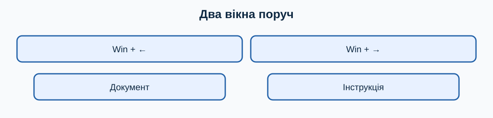

# 5. Вікна й віртуальні робочі столи

[← Попередній розділ](./04-hotkeys.md) · [До змісту](../README.md) · [Наступний розділ →](./06-files-explorer.md)

> **Клавіатура перш за все:** спробуйте виконувати повторювані кроки клавішами. Миша залишається корисною для візуальних дій, але клавіатурна команда зазвичай потребує менше рухів і не вимагає точного наведення.

## Перемикання і закриття

`Alt+Tab` показує відкриті вікна. Тримайте `Alt`, натискайте `Tab`, а на потрібному вікні відпустіть `Alt`. `Alt+Shift+Tab` рухається у зворотному напрямку. `Alt+F4` закриває активну програму; якщо документ змінено, уважно прочитайте запит про збереження.

## Прив’язка вікон

`Win+←` та `Win+→` розміщують вікно на половині екрана, `Win+Z` відкриває макети. Це корисно для порівняння документа й інструкції. Клавіші дають точне розташування за один крок, тоді як мишею доводиться тягнути межі.

## Віртуальні робочі столи

Столи допомагають розділити роботу, навчання й особисті справи. `Win+Ctrl+D` створює стіл, `Win+Ctrl+→` переходить праворуч, `Win+Ctrl+←` — ліворуч. `Win+Ctrl+F4` закриває поточний стіл, але не програми: їхні вікна переходять на сусідній.

## Кілька моніторів

Під’єднайте другий монітор і ввімкніть його, а потім відкрийте **Параметри → Система → Дисплей**. Якщо Windows не показує обидва екрани, розгорніть розділ **Кілька дисплеїв** і скористайтеся пошуком підключеного дисплея. Також перевірте кабель, живлення та правильний вхід на самому моніторі.

### Розташування двох екранів

1. Натисніть **Визначити**, щоб на кожному фізичному екрані з’явився його номер.
2. Перетягніть пронумеровані прямокутники в Параметрах так, як монітори стоять на столі: ліворуч/праворуч і, за потреби, вище/нижче.
3. Натисніть **Застосувати** й переведіть вказівник через спільний край. Якщо він «упирається» або переходить не з того боку, ще раз вирівняйте прямокутники.

Виберіть кожний дисплей окремо, щоб установити для нього рекомендовану роздільну здатність, зручний масштаб і правильну орієнтацію. За потреби виберіть робочий екран і ввімкніть **Зробити основним дисплеєм** — на ньому з’являтимуться меню **Пуск**, пошук і більшість нових вікон.

### Режими показу та переміщення вікон

`Win+P` відкриває режими відображення:

- **Лише екран ПК** — працює тільки основний екран комп’ютера;
- **Дублювати** — обидва екрани показують те саме, що зручно для простої презентації;
- **Розширити** — два екрани утворюють спільний робочий простір;
- **Лише другий екран** — вбудований або основний екран вимкнено.

Для постійної роботи з двома моніторами зазвичай потрібен режим **Розширити**. `Win+Shift+←` чи `Win+Shift+→` переносить активне вікно на сусідній монітор. Не перемикайте режим навмання під час презентації. Якщо після зміни екран спорожнів, зачекайте на автоматичне повернення або натисніть `Win+P`, виберіть потрібний режим стрілками й підтвердьте через `Enter`.

## Навчальна майстерня: десять коротких занять

Кожне заняття виконуйте окремо. Спочатку прочитайте весь опис, потім працюйте на тестових даних. Після виконання повторіть дію клавіатурою ще двічі: повторення перетворює комбінацію на звичку й зменшує потребу шукати кнопки мишею.

### Заняття 1. Як прикріпити вікно ліворуч

**Підготовка.** Збережіть відкриті документи через `Ctrl+S` і переконайтеся, що активне правильне вікно. Якщо вправа стосується файлів, використовуйте лише спеціально створені копії. Подивіться, де зараз фокус: клавіатурна команда діє саме на активний елемент.

**Виконання.** Спробуйте прикріпити вікно ліворуч. Спочатку виконайте шлях, описаний у цьому розділі, не торкаючись миші. Якщо фокус загубився, натискайте `Tab` або `Shift+Tab`; стрілки змінюють вибір, `Enter` підтверджує, а `Esc` безпечно закриває більшість меню. Не підтверджуйте дію, наслідків якої не розумієте.

**Спостереження.** Порахуйте кроки: одна комбінація часто замінює пошук піктограми, наведення та клацання. Запишіть комбінацію і ситуацію, де вона справді корисна. Якщо миша в цьому завданні зручніша, також запишіть чому: мета — свідомо обирати найефективніший інструмент, а не відмовитися від миші за будь-яку ціну.

- [ ] Дію виконано на безпечних даних.
- [ ] Результат перевірено.
- [ ] Я можу повторити дію клавіатурою.

### Заняття 2. Як прикріпити вікно праворуч

**Підготовка.** Збережіть відкриті документи через `Ctrl+S` і переконайтеся, що активне правильне вікно. Якщо вправа стосується файлів, використовуйте лише спеціально створені копії. Подивіться, де зараз фокус: клавіатурна команда діє саме на активний елемент.

**Виконання.** Спробуйте прикріпити вікно праворуч. Спочатку виконайте шлях, описаний у цьому розділі, не торкаючись миші. Якщо фокус загубився, натискайте `Tab` або `Shift+Tab`; стрілки змінюють вибір, `Enter` підтверджує, а `Esc` безпечно закриває більшість меню. Не підтверджуйте дію, наслідків якої не розумієте.

**Спостереження.** Порахуйте кроки: одна комбінація часто замінює пошук піктограми, наведення та клацання. Запишіть комбінацію і ситуацію, де вона справді корисна. Якщо миша в цьому завданні зручніша, також запишіть чому: мета — свідомо обирати найефективніший інструмент, а не відмовитися від миші за будь-яку ціну.

- [ ] Дію виконано на безпечних даних.
- [ ] Результат перевірено.
- [ ] Я можу повторити дію клавіатурою.

### Заняття 3. Як відкрити макети прив’язки

**Підготовка.** Збережіть відкриті документи через `Ctrl+S` і переконайтеся, що активне правильне вікно. Якщо вправа стосується файлів, використовуйте лише спеціально створені копії. Подивіться, де зараз фокус: клавіатурна команда діє саме на активний елемент.

**Виконання.** Спробуйте відкрити макети прив’язки. Спочатку виконайте шлях, описаний у цьому розділі, не торкаючись миші. Якщо фокус загубився, натискайте `Tab` або `Shift+Tab`; стрілки змінюють вибір, `Enter` підтверджує, а `Esc` безпечно закриває більшість меню. Не підтверджуйте дію, наслідків якої не розумієте.

**Спостереження.** Порахуйте кроки: одна комбінація часто замінює пошук піктограми, наведення та клацання. Запишіть комбінацію і ситуацію, де вона справді корисна. Якщо миша в цьому завданні зручніша, також запишіть чому: мета — свідомо обирати найефективніший інструмент, а не відмовитися від миші за будь-яку ціну.

- [ ] Дію виконано на безпечних даних.
- [ ] Результат перевірено.
- [ ] Я можу повторити дію клавіатурою.

### Заняття 4. Як створити робочий стіл

**Підготовка.** Збережіть відкриті документи через `Ctrl+S` і переконайтеся, що активне правильне вікно. Якщо вправа стосується файлів, використовуйте лише спеціально створені копії. Подивіться, де зараз фокус: клавіатурна команда діє саме на активний елемент.

**Виконання.** Спробуйте створити робочий стіл. Спочатку виконайте шлях, описаний у цьому розділі, не торкаючись миші. Якщо фокус загубився, натискайте `Tab` або `Shift+Tab`; стрілки змінюють вибір, `Enter` підтверджує, а `Esc` безпечно закриває більшість меню. Не підтверджуйте дію, наслідків якої не розумієте.

**Спостереження.** Порахуйте кроки: одна комбінація часто замінює пошук піктограми, наведення та клацання. Запишіть комбінацію і ситуацію, де вона справді корисна. Якщо миша в цьому завданні зручніша, також запишіть чому: мета — свідомо обирати найефективніший інструмент, а не відмовитися від миші за будь-яку ціну.

- [ ] Дію виконано на безпечних даних.
- [ ] Результат перевірено.
- [ ] Я можу повторити дію клавіатурою.

### Заняття 5. Як перейти між столами

**Підготовка.** Збережіть відкриті документи через `Ctrl+S` і переконайтеся, що активне правильне вікно. Якщо вправа стосується файлів, використовуйте лише спеціально створені копії. Подивіться, де зараз фокус: клавіатурна команда діє саме на активний елемент.

**Виконання.** Спробуйте перейти між столами. Спочатку виконайте шлях, описаний у цьому розділі, не торкаючись миші. Якщо фокус загубився, натискайте `Tab` або `Shift+Tab`; стрілки змінюють вибір, `Enter` підтверджує, а `Esc` безпечно закриває більшість меню. Не підтверджуйте дію, наслідків якої не розумієте.

**Спостереження.** Порахуйте кроки: одна комбінація часто замінює пошук піктограми, наведення та клацання. Запишіть комбінацію і ситуацію, де вона справді корисна. Якщо миша в цьому завданні зручніша, також запишіть чому: мета — свідомо обирати найефективніший інструмент, а не відмовитися від миші за будь-яку ціну.

- [ ] Дію виконано на безпечних даних.
- [ ] Результат перевірено.
- [ ] Я можу повторити дію клавіатурою.

### Заняття 6. Як закрити додатковий стіл

**Підготовка.** Збережіть відкриті документи через `Ctrl+S` і переконайтеся, що активне правильне вікно. Якщо вправа стосується файлів, використовуйте лише спеціально створені копії. Подивіться, де зараз фокус: клавіатурна команда діє саме на активний елемент.

**Виконання.** Спробуйте закрити додатковий стіл. Спочатку виконайте шлях, описаний у цьому розділі, не торкаючись миші. Якщо фокус загубився, натискайте `Tab` або `Shift+Tab`; стрілки змінюють вибір, `Enter` підтверджує, а `Esc` безпечно закриває більшість меню. Не підтверджуйте дію, наслідків якої не розумієте.

**Спостереження.** Порахуйте кроки: одна комбінація часто замінює пошук піктограми, наведення та клацання. Запишіть комбінацію і ситуацію, де вона справді корисна. Якщо миша в цьому завданні зручніша, також запишіть чому: мета — свідомо обирати найефективніший інструмент, а не відмовитися від миші за будь-яку ціну.

- [ ] Дію виконано на безпечних даних.
- [ ] Результат перевірено.
- [ ] Я можу повторити дію клавіатурою.

### Заняття 7. Як перенести вікно на інший монітор

**Підготовка.** Збережіть відкриті документи через `Ctrl+S` і переконайтеся, що активне правильне вікно. Якщо вправа стосується файлів, використовуйте лише спеціально створені копії. Подивіться, де зараз фокус: клавіатурна команда діє саме на активний елемент.

**Виконання.** Спробуйте перенести вікно на інший монітор. Спочатку виконайте шлях, описаний у цьому розділі, не торкаючись миші. Якщо фокус загубився, натискайте `Tab` або `Shift+Tab`; стрілки змінюють вибір, `Enter` підтверджує, а `Esc` безпечно закриває більшість меню. Не підтверджуйте дію, наслідків якої не розумієте.

**Спостереження.** Порахуйте кроки: одна комбінація часто замінює пошук піктограми, наведення та клацання. Запишіть комбінацію і ситуацію, де вона справді корисна. Якщо миша в цьому завданні зручніша, також запишіть чому: мета — свідомо обирати найефективніший інструмент, а не відмовитися від миші за будь-яку ціну.

- [ ] Дію виконано на безпечних даних.
- [ ] Результат перевірено.
- [ ] Я можу повторити дію клавіатурою.

### Заняття 8. Як відкрити подання завдань

**Підготовка.** Збережіть відкриті документи через `Ctrl+S` і переконайтеся, що активне правильне вікно. Якщо вправа стосується файлів, використовуйте лише спеціально створені копії. Подивіться, де зараз фокус: клавіатурна команда діє саме на активний елемент.

**Виконання.** Спробуйте відкрити подання завдань. Спочатку виконайте шлях, описаний у цьому розділі, не торкаючись миші. Якщо фокус загубився, натискайте `Tab` або `Shift+Tab`; стрілки змінюють вибір, `Enter` підтверджує, а `Esc` безпечно закриває більшість меню. Не підтверджуйте дію, наслідків якої не розумієте.

**Спостереження.** Порахуйте кроки: одна комбінація часто замінює пошук піктограми, наведення та клацання. Запишіть комбінацію і ситуацію, де вона справді корисна. Якщо миша в цьому завданні зручніша, також запишіть чому: мета — свідомо обирати найефективніший інструмент, а не відмовитися від миші за будь-яку ціну.

- [ ] Дію виконано на безпечних даних.
- [ ] Результат перевірено.
- [ ] Я можу повторити дію клавіатурою.

### Заняття 9. Як закрити програму без втрати даних

**Підготовка.** Збережіть відкриті документи через `Ctrl+S` і переконайтеся, що активне правильне вікно. Якщо вправа стосується файлів, використовуйте лише спеціально створені копії. Подивіться, де зараз фокус: клавіатурна команда діє саме на активний елемент.

**Виконання.** Спробуйте закрити програму без втрати даних. Спочатку виконайте шлях, описаний у цьому розділі, не торкаючись миші. Якщо фокус загубився, натискайте `Tab` або `Shift+Tab`; стрілки змінюють вибір, `Enter` підтверджує, а `Esc` безпечно закриває більшість меню. Не підтверджуйте дію, наслідків якої не розумієте.

**Спостереження.** Порахуйте кроки: одна комбінація часто замінює пошук піктограми, наведення та клацання. Запишіть комбінацію і ситуацію, де вона справді корисна. Якщо миша в цьому завданні зручніша, також запишіть чому: мета — свідомо обирати найефективніший інструмент, а не відмовитися від миші за будь-яку ціну.

- [ ] Дію виконано на безпечних даних.
- [ ] Результат перевірено.
- [ ] Я можу повторити дію клавіатурою.

### Заняття 10. Як відновити згорнуте вікно

**Підготовка.** Збережіть відкриті документи через `Ctrl+S` і переконайтеся, що активне правильне вікно. Якщо вправа стосується файлів, використовуйте лише спеціально створені копії. Подивіться, де зараз фокус: клавіатурна команда діє саме на активний елемент.

**Виконання.** Спробуйте відновити згорнуте вікно. Спочатку виконайте шлях, описаний у цьому розділі, не торкаючись миші. Якщо фокус загубився, натискайте `Tab` або `Shift+Tab`; стрілки змінюють вибір, `Enter` підтверджує, а `Esc` безпечно закриває більшість меню. Не підтверджуйте дію, наслідків якої не розумієте.

**Спостереження.** Порахуйте кроки: одна комбінація часто замінює пошук піктограми, наведення та клацання. Запишіть комбінацію і ситуацію, де вона справді корисна. Якщо миша в цьому завданні зручніша, також запишіть чому: мета — свідомо обирати найефективніший інструмент, а не відмовитися від миші за будь-яку ціну.

- [ ] Дію виконано на безпечних даних.
- [ ] Результат перевірено.
- [ ] Я можу повторити дію клавіатурою.

## Запитання для повторення й обговорення

### 1. Яка частина цієї дії потребує найбільше уваги?

Сформулюйте відповідь власними словами й наведіть один побутовий приклад. Корисна відповідь має назвати активне вікно або вибраний об’єкт, потрібну клавіатурну команду, очікуваний результат і спосіб безпечної перевірки. Для ризикованої операції обов’язково додайте резервну копію або можливість скасування. Не оцінюйте швидкість лише за першу спробу: порівнюйте способи після кількох повторень.

### 2. Що зміниться, якщо фокус перебуває не в тому вікні?

Сформулюйте відповідь власними словами й наведіть один побутовий приклад. Корисна відповідь має назвати активне вікно або вибраний об’єкт, потрібну клавіатурну команду, очікуваний результат і спосіб безпечної перевірки. Для ризикованої операції обов’язково додайте резервну копію або можливість скасування. Не оцінюйте швидкість лише за першу спробу: порівнюйте способи після кількох повторень.

### 3. Яку команду слід запам’ятати першою?

Сформулюйте відповідь власними словами й наведіть один побутовий приклад. Корисна відповідь має назвати активне вікно або вибраний об’єкт, потрібну клавіатурну команду, очікуваний результат і спосіб безпечної перевірки. Для ризикованої операції обов’язково додайте резервну копію або можливість скасування. Не оцінюйте швидкість лише за першу спробу: порівнюйте способи після кількох повторень.

### 4. Коли миша все ж буде зручнішою?

Сформулюйте відповідь власними словами й наведіть один побутовий приклад. Корисна відповідь має назвати активне вікно або вибраний об’єкт, потрібну клавіатурну команду, очікуваний результат і спосіб безпечної перевірки. Для ризикованої операції обов’язково додайте резервну копію або можливість скасування. Не оцінюйте швидкість лише за першу спробу: порівнюйте способи після кількох повторень.

### 5. Як безпечно виправити помилкову дію?

Сформулюйте відповідь власними словами й наведіть один побутовий приклад. Корисна відповідь має назвати активне вікно або вибраний об’єкт, потрібну клавіатурну команду, очікуваний результат і спосіб безпечної перевірки. Для ризикованої операції обов’язково додайте резервну копію або можливість скасування. Не оцінюйте швидкість лише за першу спробу: порівнюйте способи після кількох повторень.

### 6. Як пояснити цей матеріал іншій людині?

Сформулюйте відповідь власними словами й наведіть один побутовий приклад. Корисна відповідь має назвати активне вікно або вибраний об’єкт, потрібну клавіатурну команду, очікуваний результат і спосіб безпечної перевірки. Для ризикованої операції обов’язково додайте резервну копію або можливість скасування. Не оцінюйте швидкість лише за першу спробу: порівнюйте способи після кількох повторень.

## Практична вправа

Відкрийте дві безпечні програми, розмістіть їх поруч, створіть другий робочий стіл і поверніться на перший.

## Самоперевірка

- [ ] Я виконав вправу на тестових даних.
- [ ] Я використав щонайменше дві команди клавіатури.
- [ ] Я можу пояснити дію іншій людині.
- [ ] Я не змінював незрозумілі або небезпечні параметри.

## Короткий тест

### 1. Що робить `Alt+Tab`?

- Перемикає програми
- Видаляє файл
- Вимикає комп’ютер

Показати відповідь

Комбінація перемикає відкриті вікна.

### 2. Навіщо потрібен `Esc`?

- Скасувати або закрити поточний елемент
- Назавжди видалити систему
- Збільшити звук

Показати відповідь

`Esc` зазвичай закриває меню, діалог або скасовує поточну операцію.

---

[← Попередній розділ](./04-hotkeys.md) · [До змісту](../README.md) · [Наступний розділ →](./06-files-explorer.md)
