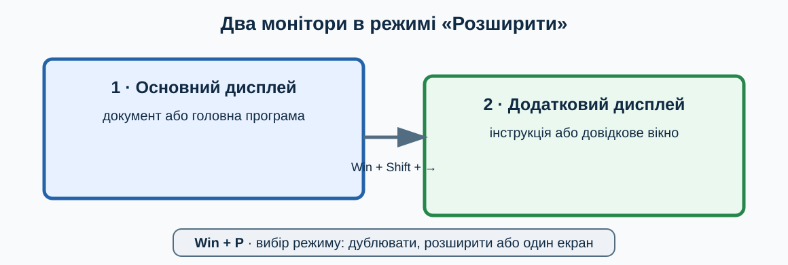

# 5. Вікна й віртуальні робочі столи

[← Попередній розділ](./04-hotkeys.md) · [До змісту](../README.md) · [Наступний розділ →](./06-files-explorer.md)

> **Клавіатура перш за все:** спробуйте виконувати повторювані кроки клавішами. Миша залишається корисною для візуальних дій, але клавіатурна команда зазвичай потребує менше рухів і не вимагає точного наведення.

## Перемикання і закриття

`Alt+Tab` показує відкриті вікна. Тримайте `Alt`, натискайте `Tab`, а на потрібному вікні відпустіть `Alt`. `Alt+Shift+Tab` рухається у зворотному напрямку. `Alt+F4` закриває активну програму; якщо документ змінено, уважно прочитайте запит про збереження.

## Прив’язка вікон

`Win+←` та `Win+→` розміщують вікно на половині екрана, `Win+Z` відкриває макети. Це корисно для порівняння документа й інструкції. Клавіші дають точне розташування за один крок, тоді як мишею доводиться тягнути межі.

## Віртуальні робочі столи

Столи допомагають розділити роботу, навчання й особисті справи. `Win+Ctrl+D` створює стіл, `Win+Ctrl+→` переходить праворуч, `Win+Ctrl+←` — ліворуч. `Win+Ctrl+F4` закриває поточний стіл, але не програми: їхні вікна переходять на сусідній.

## Кілька моніторів

Під’єднайте другий екран до живлення та комп’ютера, виберіть на ньому правильне джерело сигналу, а потім натисніть `Win+P`. Панель **Проєктувати** має чотири типові режими:

| Режим | Що відбувається | Коли використовувати |
|---|---|---|
| **Лише екран ПК** | Працює тільки основний дисплей | Другий екран тимчасово не потрібний |
| **Дублювати** | Обидва дисплеї показують однакове | Презентація або навчальна демонстрація |
| **Розширити** | Другий дисплей додає робочу площу | Документ на одному екрані, інструкція на іншому |
| **Лише другий екран** | Вбудований або основний екран вимикається | Робота з великим зовнішнім монітором |

У панелі `Win+P` рухайтеся стрілками та підтверджуйте через `Enter`. Не вибирайте режим навмання під час важливої презентації: потренуйтеся заздалегідь. Якщо зображення зникло, зачекайте кілька секунд або знову натисніть `Win+P` і виберіть відомий режим.

### Розташування екранів

Відкрийте `Win+I` → **Система → Дисплей**. Натисніть **Визначити**, щоб на фізичних екранах з’явилися великі номери. У схемі перетягніть прямокутники так, як монітори стоять на столі: лівий праворуч, вищий трохи вище тощо. Після цього вказівник і вікна переходитимуть через спільну межу природно. Саме розташування — візуальна дія, для якої миша зазвичай зручніша за клавіатуру.

Якщо другого прямокутника немає, перевірте кабель, живлення та вхід на моніторі, а тоді виберіть **Кілька дисплеїв → Виявити**. Перехідник має підтримувати потрібний відеосигнал; не кожен USB-порт передає зображення.

### Основний дисплей, масштаб і роздільна здатність

Виберіть прямокутник потрібного монітора перед зміною параметра. Для кожного екрана окремо можна встановити масштаб, рекомендовану роздільну здатність, орієнтацію та частоту оновлення. Зазвичай залишайте позначену як **Рекомендовано** роздільну здатність, а для читабельності змінюйте **Масштаб**. Неправильна роздільна здатність робить текст розмитим.

Позначка **Зробити цей дисплей основним** визначає, де зазвичай з’являються меню «Пуск», нові вікна та системні повідомлення. Вибирайте екран, перед яким сидите прямо. Після зміни масштабу деяким старим програмам може знадобитися повторний запуск.

### Переміщення вікон клавіатурою

У режимі **Розширити** натисніть `Win+Shift+←` або `Win+Shift+→`, щоб миттєво перенести активне вікно на сусідній монітор. Це значно швидше й точніше, ніж тягнути вікно через межу екранів. Далі `Win+←`, `Win+→` або `Win+Z` допоможуть розмістити його на потрібній половині чи в макеті.

Якщо вікно «загубилося» на від’єднаному дисплеї, виберіть програму через `Alt+Tab`, а потім натискайте `Win+Shift+←` або `Win+Shift+→`, доки воно не повернеться. Інший спосіб — тимчасово вибрати **Лише екран ПК** через `Win+P`.

### Звук і презентація

HDMI або DisplayPort може автоматично перевести звук на динаміки монітора. Якщо звук зник, відкрийте `Win+A` і перевірте пристрій виведення. Перед демонстрацією вимкніть приватні сповіщення, перевірте режим, масштаб слайдів та звук на тому екрані, який бачитиме аудиторія.

## Навчальна майстерня: десять коротких занять

Кожне заняття виконуйте окремо. Спочатку прочитайте весь опис, потім працюйте на тестових даних. Після виконання повторіть дію клавіатурою ще двічі: повторення перетворює комбінацію на звичку й зменшує потребу шукати кнопки мишею.

### Заняття 1. Як прикріпити вікно ліворуч

**Підготовка.** Збережіть відкриті документи через `Ctrl+S` і переконайтеся, що активне правильне вікно. Якщо вправа стосується файлів, використовуйте лише спеціально створені копії. Подивіться, де зараз фокус: клавіатурна команда діє саме на активний елемент.

**Виконання.** Спробуйте прикріпити вікно ліворуч. Спочатку виконайте шлях, описаний у цьому розділі, не торкаючись миші. Якщо фокус загубився, натискайте `Tab` або `Shift+Tab`; стрілки змінюють вибір, `Enter` підтверджує, а `Esc` безпечно закриває більшість меню. Не підтверджуйте дію, наслідків якої не розумієте.

**Спостереження.** Порахуйте кроки: одна комбінація часто замінює пошук піктограми, наведення та клацання. Запишіть комбінацію і ситуацію, де вона справді корисна. Якщо миша в цьому завданні зручніша, також запишіть чому: мета — свідомо обирати найефективніший інструмент, а не відмовитися від миші за будь-яку ціну.

- [ ] Дію виконано на безпечних даних.
- [ ] Результат перевірено.
- [ ] Я можу повторити дію клавіатурою.

### Заняття 2. Як прикріпити вікно праворуч

**Підготовка.** Збережіть відкриті документи через `Ctrl+S` і переконайтеся, що активне правильне вікно. Якщо вправа стосується файлів, використовуйте лише спеціально створені копії. Подивіться, де зараз фокус: клавіатурна команда діє саме на активний елемент.

**Виконання.** Спробуйте прикріпити вікно праворуч. Спочатку виконайте шлях, описаний у цьому розділі, не торкаючись миші. Якщо фокус загубився, натискайте `Tab` або `Shift+Tab`; стрілки змінюють вибір, `Enter` підтверджує, а `Esc` безпечно закриває більшість меню. Не підтверджуйте дію, наслідків якої не розумієте.

**Спостереження.** Порахуйте кроки: одна комбінація часто замінює пошук піктограми, наведення та клацання. Запишіть комбінацію і ситуацію, де вона справді корисна. Якщо миша в цьому завданні зручніша, також запишіть чому: мета — свідомо обирати найефективніший інструмент, а не відмовитися від миші за будь-яку ціну.

- [ ] Дію виконано на безпечних даних.
- [ ] Результат перевірено.
- [ ] Я можу повторити дію клавіатурою.

### Заняття 3. Як відкрити макети прив’язки

**Підготовка.** Збережіть відкриті документи через `Ctrl+S` і переконайтеся, що активне правильне вікно. Якщо вправа стосується файлів, використовуйте лише спеціально створені копії. Подивіться, де зараз фокус: клавіатурна команда діє саме на активний елемент.

**Виконання.** Спробуйте відкрити макети прив’язки. Спочатку виконайте шлях, описаний у цьому розділі, не торкаючись миші. Якщо фокус загубився, натискайте `Tab` або `Shift+Tab`; стрілки змінюють вибір, `Enter` підтверджує, а `Esc` безпечно закриває більшість меню. Не підтверджуйте дію, наслідків якої не розумієте.

**Спостереження.** Порахуйте кроки: одна комбінація часто замінює пошук піктограми, наведення та клацання. Запишіть комбінацію і ситуацію, де вона справді корисна. Якщо миша в цьому завданні зручніша, також запишіть чому: мета — свідомо обирати найефективніший інструмент, а не відмовитися від миші за будь-яку ціну.

- [ ] Дію виконано на безпечних даних.
- [ ] Результат перевірено.
- [ ] Я можу повторити дію клавіатурою.

### Заняття 4. Як створити робочий стіл

**Підготовка.** Збережіть відкриті документи через `Ctrl+S` і переконайтеся, що активне правильне вікно. Якщо вправа стосується файлів, використовуйте лише спеціально створені копії. Подивіться, де зараз фокус: клавіатурна команда діє саме на активний елемент.

**Виконання.** Спробуйте створити робочий стіл. Спочатку виконайте шлях, описаний у цьому розділі, не торкаючись миші. Якщо фокус загубився, натискайте `Tab` або `Shift+Tab`; стрілки змінюють вибір, `Enter` підтверджує, а `Esc` безпечно закриває більшість меню. Не підтверджуйте дію, наслідків якої не розумієте.

**Спостереження.** Порахуйте кроки: одна комбінація часто замінює пошук піктограми, наведення та клацання. Запишіть комбінацію і ситуацію, де вона справді корисна. Якщо миша в цьому завданні зручніша, також запишіть чому: мета — свідомо обирати найефективніший інструмент, а не відмовитися від миші за будь-яку ціну.

- [ ] Дію виконано на безпечних даних.
- [ ] Результат перевірено.
- [ ] Я можу повторити дію клавіатурою.

### Заняття 5. Як перейти між столами

**Підготовка.** Збережіть відкриті документи через `Ctrl+S` і переконайтеся, що активне правильне вікно. Якщо вправа стосується файлів, використовуйте лише спеціально створені копії. Подивіться, де зараз фокус: клавіатурна команда діє саме на активний елемент.

**Виконання.** Спробуйте перейти між столами. Спочатку виконайте шлях, описаний у цьому розділі, не торкаючись миші. Якщо фокус загубився, натискайте `Tab` або `Shift+Tab`; стрілки змінюють вибір, `Enter` підтверджує, а `Esc` безпечно закриває більшість меню. Не підтверджуйте дію, наслідків якої не розумієте.

**Спостереження.** Порахуйте кроки: одна комбінація часто замінює пошук піктограми, наведення та клацання. Запишіть комбінацію і ситуацію, де вона справді корисна. Якщо миша в цьому завданні зручніша, також запишіть чому: мета — свідомо обирати найефективніший інструмент, а не відмовитися від миші за будь-яку ціну.

- [ ] Дію виконано на безпечних даних.
- [ ] Результат перевірено.
- [ ] Я можу повторити дію клавіатурою.

### Заняття 6. Як закрити додатковий стіл

**Підготовка.** Збережіть відкриті документи через `Ctrl+S` і переконайтеся, що активне правильне вікно. Якщо вправа стосується файлів, використовуйте лише спеціально створені копії. Подивіться, де зараз фокус: клавіатурна команда діє саме на активний елемент.

**Виконання.** Спробуйте закрити додатковий стіл. Спочатку виконайте шлях, описаний у цьому розділі, не торкаючись миші. Якщо фокус загубився, натискайте `Tab` або `Shift+Tab`; стрілки змінюють вибір, `Enter` підтверджує, а `Esc` безпечно закриває більшість меню. Не підтверджуйте дію, наслідків якої не розумієте.

**Спостереження.** Порахуйте кроки: одна комбінація часто замінює пошук піктограми, наведення та клацання. Запишіть комбінацію і ситуацію, де вона справді корисна. Якщо миша в цьому завданні зручніша, також запишіть чому: мета — свідомо обирати найефективніший інструмент, а не відмовитися від миші за будь-яку ціну.

- [ ] Дію виконано на безпечних даних.
- [ ] Результат перевірено.
- [ ] Я можу повторити дію клавіатурою.

### Заняття 7. Як перенести вікно на інший монітор

**Підготовка.** Збережіть відкриті документи через `Ctrl+S` і переконайтеся, що активне правильне вікно. Якщо вправа стосується файлів, використовуйте лише спеціально створені копії. Подивіться, де зараз фокус: клавіатурна команда діє саме на активний елемент.

**Виконання.** Спробуйте перенести вікно на інший монітор. Спочатку виконайте шлях, описаний у цьому розділі, не торкаючись миші. Якщо фокус загубився, натискайте `Tab` або `Shift+Tab`; стрілки змінюють вибір, `Enter` підтверджує, а `Esc` безпечно закриває більшість меню. Не підтверджуйте дію, наслідків якої не розумієте.

**Спостереження.** Порахуйте кроки: одна комбінація часто замінює пошук піктограми, наведення та клацання. Запишіть комбінацію і ситуацію, де вона справді корисна. Якщо миша в цьому завданні зручніша, також запишіть чому: мета — свідомо обирати найефективніший інструмент, а не відмовитися від миші за будь-яку ціну.

- [ ] Дію виконано на безпечних даних.
- [ ] Результат перевірено.
- [ ] Я можу повторити дію клавіатурою.

### Заняття 8. Як відкрити подання завдань

**Підготовка.** Збережіть відкриті документи через `Ctrl+S` і переконайтеся, що активне правильне вікно. Якщо вправа стосується файлів, використовуйте лише спеціально створені копії. Подивіться, де зараз фокус: клавіатурна команда діє саме на активний елемент.

**Виконання.** Спробуйте відкрити подання завдань. Спочатку виконайте шлях, описаний у цьому розділі, не торкаючись миші. Якщо фокус загубився, натискайте `Tab` або `Shift+Tab`; стрілки змінюють вибір, `Enter` підтверджує, а `Esc` безпечно закриває більшість меню. Не підтверджуйте дію, наслідків якої не розумієте.

**Спостереження.** Порахуйте кроки: одна комбінація часто замінює пошук піктограми, наведення та клацання. Запишіть комбінацію і ситуацію, де вона справді корисна. Якщо миша в цьому завданні зручніша, також запишіть чому: мета — свідомо обирати найефективніший інструмент, а не відмовитися від миші за будь-яку ціну.

- [ ] Дію виконано на безпечних даних.
- [ ] Результат перевірено.
- [ ] Я можу повторити дію клавіатурою.

### Заняття 9. Як закрити програму без втрати даних

**Підготовка.** Збережіть відкриті документи через `Ctrl+S` і переконайтеся, що активне правильне вікно. Якщо вправа стосується файлів, використовуйте лише спеціально створені копії. Подивіться, де зараз фокус: клавіатурна команда діє саме на активний елемент.

**Виконання.** Спробуйте закрити програму без втрати даних. Спочатку виконайте шлях, описаний у цьому розділі, не торкаючись миші. Якщо фокус загубився, натискайте `Tab` або `Shift+Tab`; стрілки змінюють вибір, `Enter` підтверджує, а `Esc` безпечно закриває більшість меню. Не підтверджуйте дію, наслідків якої не розумієте.

**Спостереження.** Порахуйте кроки: одна комбінація часто замінює пошук піктограми, наведення та клацання. Запишіть комбінацію і ситуацію, де вона справді корисна. Якщо миша в цьому завданні зручніша, також запишіть чому: мета — свідомо обирати найефективніший інструмент, а не відмовитися від миші за будь-яку ціну.

- [ ] Дію виконано на безпечних даних.
- [ ] Результат перевірено.
- [ ] Я можу повторити дію клавіатурою.

### Заняття 10. Як відновити згорнуте вікно

**Підготовка.** Збережіть відкриті документи через `Ctrl+S` і переконайтеся, що активне правильне вікно. Якщо вправа стосується файлів, використовуйте лише спеціально створені копії. Подивіться, де зараз фокус: клавіатурна команда діє саме на активний елемент.

**Виконання.** Спробуйте відновити згорнуте вікно. Спочатку виконайте шлях, описаний у цьому розділі, не торкаючись миші. Якщо фокус загубився, натискайте `Tab` або `Shift+Tab`; стрілки змінюють вибір, `Enter` підтверджує, а `Esc` безпечно закриває більшість меню. Не підтверджуйте дію, наслідків якої не розумієте.

**Спостереження.** Порахуйте кроки: одна комбінація часто замінює пошук піктограми, наведення та клацання. Запишіть комбінацію і ситуацію, де вона справді корисна. Якщо миша в цьому завданні зручніша, також запишіть чому: мета — свідомо обирати найефективніший інструмент, а не відмовитися від миші за будь-яку ціну.

- [ ] Дію виконано на безпечних даних.
- [ ] Результат перевірено.
- [ ] Я можу повторити дію клавіатурою.

## Запитання для повторення й обговорення

### 1. Яка частина цієї дії потребує найбільше уваги?

Сформулюйте відповідь власними словами й наведіть один побутовий приклад. Корисна відповідь має назвати активне вікно або вибраний об’єкт, потрібну клавіатурну команду, очікуваний результат і спосіб безпечної перевірки. Для ризикованої операції обов’язково додайте резервну копію або можливість скасування. Не оцінюйте швидкість лише за першу спробу: порівнюйте способи після кількох повторень.

### 2. Що зміниться, якщо фокус перебуває не в тому вікні?

Сформулюйте відповідь власними словами й наведіть один побутовий приклад. Корисна відповідь має назвати активне вікно або вибраний об’єкт, потрібну клавіатурну команду, очікуваний результат і спосіб безпечної перевірки. Для ризикованої операції обов’язково додайте резервну копію або можливість скасування. Не оцінюйте швидкість лише за першу спробу: порівнюйте способи після кількох повторень.

### 3. Яку команду слід запам’ятати першою?

Сформулюйте відповідь власними словами й наведіть один побутовий приклад. Корисна відповідь має назвати активне вікно або вибраний об’єкт, потрібну клавіатурну команду, очікуваний результат і спосіб безпечної перевірки. Для ризикованої операції обов’язково додайте резервну копію або можливість скасування. Не оцінюйте швидкість лише за першу спробу: порівнюйте способи після кількох повторень.

### 4. Коли миша все ж буде зручнішою?

Сформулюйте відповідь власними словами й наведіть один побутовий приклад. Корисна відповідь має назвати активне вікно або вибраний об’єкт, потрібну клавіатурну команду, очікуваний результат і спосіб безпечної перевірки. Для ризикованої операції обов’язково додайте резервну копію або можливість скасування. Не оцінюйте швидкість лише за першу спробу: порівнюйте способи після кількох повторень.

### 5. Як безпечно виправити помилкову дію?

Сформулюйте відповідь власними словами й наведіть один побутовий приклад. Корисна відповідь має назвати активне вікно або вибраний об’єкт, потрібну клавіатурну команду, очікуваний результат і спосіб безпечної перевірки. Для ризикованої операції обов’язково додайте резервну копію або можливість скасування. Не оцінюйте швидкість лише за першу спробу: порівнюйте способи після кількох повторень.

### 6. Як пояснити цей матеріал іншій людині?

Сформулюйте відповідь власними словами й наведіть один побутовий приклад. Корисна відповідь має назвати активне вікно або вибраний об’єкт, потрібну клавіатурну команду, очікуваний результат і спосіб безпечної перевірки. Для ризикованої операції обов’язково додайте резервну копію або можливість скасування. Не оцінюйте швидкість лише за першу спробу: порівнюйте способи після кількох повторень.

## Практична вправа

Відкрийте дві безпечні програми, розмістіть їх поруч, створіть другий робочий стіл і поверніться на перший. Якщо маєте другий монітор, увімкніть **Розширити** через `Win+P`, визначте номери дисплеїв і перенесіть активне вікно через `Win+Shift+→`. Поверніть початковий режим після вправи.

## Самоперевірка

- [ ] Я виконав вправу на тестових даних.
- [ ] Я використав щонайменше дві команди клавіатури.
- [ ] Я можу пояснити дію іншій людині.
- [ ] Я не змінював незрозумілі або небезпечні параметри.

## Короткий тест

### 1. Що робить `Alt+Tab`?

- Перемикає програми
- Видаляє файл
- Вимикає комп’ютер

Показати відповідь

Комбінація перемикає відкриті вікна.

### 2. Навіщо потрібен `Esc`?

- Скасувати або закрити поточний елемент
- Назавжди видалити систему
- Збільшити звук

Показати відповідь

`Esc` зазвичай закриває меню, діалог або скасовує поточну операцію.

### 3. Який режим дає окремий робочий простір на кожному моніторі?

- Розширити
- Дублювати
- Лише екран ПК

Показати відповідь

**Розширити** утворює один великий робочий простір. У режимі **Дублювати** обидва дисплеї показують те саме.

### 4. Як перенести активне вікно на сусідній монітор?

- `Win+Shift+←` або `Win+Shift+→`
- `Ctrl+S`
- `Win+L`

Показати відповідь

`Win+Shift+←` або `Win+Shift+→` переносить активне вікно між дисплеями без перетягування мишею.

---

[← Попередній розділ](./04-hotkeys.md) · [До змісту](../README.md) · [Наступний розділ →](./06-files-explorer.md)
