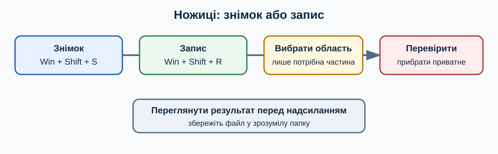
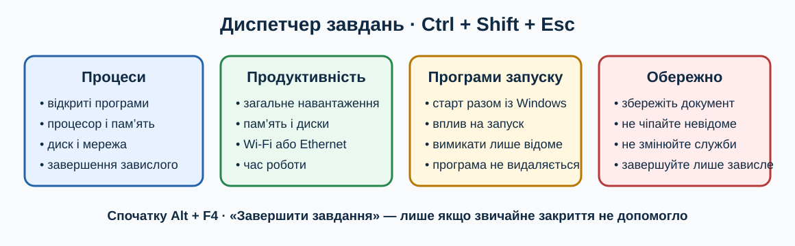

# 7. Основні стандартні програми Windows 11

[← Попередній розділ](./06-files-explorer.md) · [До змісту](../README.md) · [Наступний розділ →](./08-system-settings.md)

> **Клавіатура перш за все:** спробуйте виконувати повторювані кроки клавішами. Миша залишається корисною для візуальних дій, але клавіатурна команда зазвичай потребує менше рухів і не вимагає точного наведення.

## Як запускати програми

Найшвидший спільний спосіб: `Win`, кілька літер назви, `Enter`. Це не залежить від того, де лежить ярлик. Якщо результатів кілька, виберіть потрібний стрілками. Закривайте програму через `Alt+F4`, але спершу збережіть документ `Ctrl+S`.

## Огляд програм

| Програма | Для чого | Корисні клавіші або застереження |
|---|---|---|
| **Блокнот** | простий текст без складного оформлення | `Ctrl+N`, `Ctrl+O`, `Ctrl+S`, `Ctrl+F`, `Ctrl+H` |
| **Калькулятор** | звичайні, наукові та конвертаційні обчислення | `Ctrl+M`, `Ctrl+R`, `Ctrl+L`, `Esc` |
| **Ножиці** | знімки екрана, прості позначки та запис області екрана | `Win+Shift+S`, а в нових версіях `Win+Shift+R` |
| **Фотографії** | перегляд і базове редагування зображень | стрілки, `Ctrl++`, `Ctrl+-` |
| **Paint** | малювання, обрізання й зміна розміру | `Ctrl+N`, `Ctrl+O`, `Ctrl+S`, `Ctrl+Z` |
| **Медіапрогравач** | відтворення музики та відео | `Space`, стрілки, клавіші гучності |
| **Звукозапис** | простий запис голосу | керування кнопками через `Tab` і `Space` |
| **Годинник** | таймери, будильники та сеанси зосередження | `Tab`, стрілки, `Enter` |
| **Термінал** | інструмент командного рядка для досвідчених користувачів | не вводьте невідомі команди з інтернету |
| **Швидка допомога** | дистанційна допомога від довіреної людини | нікому не надавайте код без перевірки особи |

## Буфер обміну

`Win+V` показує історію скопійованих фрагментів після її ввімкнення. Не зберігайте там паролі, банківські дані чи конфіденційні тексти. Звичайне `Ctrl+V` вставляє останній елемент.

## Ножиці: знімок екрана

Натисніть `Win+Shift+S`: екран трохи затемниться, а вгорі з’явиться панель режимів. Можна захопити прямокутну або довільну область, окреме вікно чи весь екран. Для більшості інструкцій найзручніша прямокутна область: виділіть лише те, що допомагає зрозуміти дію, а не весь робочий стіл.

Знімок спочатку потрапляє до буфера обміну. Його можна одразу вставити через `Ctrl+V` у повідомлення або документ. Щоб обрізати, підкреслити чи приховати зайве, відкрийте сповіщення про знімок або запустіть **Ножиці** через `Win`, введення назви та `Enter`. Перед збереженням перевірте, чи не видно паролів, адрес, приватних листів, QR-кодів або одноразових кодів.

### Знімок із затримкою

Затримка потрібна, якщо треба сфотографувати меню, яке зникає після іншого клацання. Запустіть **Ножиці**, виберіть затримку, почніть створення знімка й відкрийте потрібне меню. Цей режим зручніше налаштувати у вікні програми, пересуваючись через `Tab` і підтверджуючи через `Enter` або `Space`.

## Ножиці: запис відео з екрана

У сучасних версіях Windows 11 програма **Ножиці** вміє записувати вибрану прямокутну область екрана. Натисніть `Win+Shift+R` або відкрийте Ножиці та перейдіть у режим **Запис**. Виділіть область, натисніть **Почати**, виконайте демонстрацію, а тоді натисніть **Зупинити**. Перегляньте результат до збереження.

> **Якщо `Win+Shift+R` не працює:** відкрийте Ножиці через меню «Пуск» і перевірте, чи є кнопка **Запис**. Наявність команди та запису системного звуку залежить від версії Windows і самої програми. Перевірте оновлення Ножиць у Microsoft Store, але не встановлюйте сторонній «кодек» із випадкового сайта.

Перед записом закрийте приватні вікна та сповіщення, увімкніть режим **Не турбувати**, підготуйте короткий сценарій і зробіть пробний десятисекундний запис. Ножиці записують вибрану область, тому нове вікно поза цією рамкою у відео не з’явиться. Зберігайте результат у зрозумілу папку та перевіряйте його перед надсиланням.

### Альтернатива: Xbox Game Bar

Для запису роботи в окремій програмі можна скористатися Xbox Game Bar: `Win+G` відкриває панель, а `Win+Alt+R` починає або зупиняє запис підтримуваної програми. `Win+Alt+M` перемикає мікрофон під час запису. Game Bar призначена насамперед для програм та ігор і може не записувати робочий стіл, Провідник або деякі захищені вікна. Для простої демонстрації частини екрана починайте з Ножиць.

## Диспетчер завдань

`Ctrl+Shift+Esc` відкриває Диспетчер завдань без пошуку кнопки мишею. Це основний безпечний спосіб подивитися, яка програма зависла або навантажує комп’ютер. Якщо відображається компактне вікно, виберіть **Докладніше**.

### Процеси

Розділ **Процеси** показує відкриті програми, фонові процеси та використання процесора, пам’яті, диска й мережі. Високе значення протягом кількох секунд не обов’язково означає проблему: оновлення, перевірка безпеки або відкриття великого файла природно потребують ресурсів. Спостерігайте хвилину та звертайте увагу на програму, назву якої впізнаєте.

Щоб закрити завислу програму, виберіть її стрілками або через `Tab`, а потім активуйте **Завершити завдання**. Робіть це лише коли звичайне `Alt+F4` не допомогло: незбережені зміни буде втрачено. Не завершуйте `Windows Explorer`, антивірус, системні процеси чи елемент із незрозумілою назвою лише через велике число в колонці.

### Продуктивність, журнал програм і автозавантаження

- **Продуктивність** показує загальне навантаження, обсяг пам’яті, диски, мережу й час роботи після запуску. Цей екран корисно сфотографувати для перевіреного фахівця.
- **Журнал програм** показує накопичене використання ресурсів програмами, якщо цей розділ доступний у вашій версії.
- **Програми запуску** або **Автозавантаження програм** показує, що стартує разом із входом у Windows. Вимикайте лише необов’язкову програму, яку знаєте. Це не видаляє її, але може вимкнути автоматичну синхронізацію, резервне копіювання або службові клавіші пристрою.
- **Користувачі** допомагають побачити інші активні сеанси. Не відключайте іншого користувача без попередження: він може втратити незбережену роботу.
- **Докладно** і **Служби** призначені для поглибленої діагностики. Новачкові не слід змінювати там пріоритети, служби або завершувати невідомі процеси за випадковою інструкцією.

### Безпечний порядок дій

1. Зачекайте хвилину й спробуйте `Ctrl+S` у проблемній програмі.
2. Спробуйте закрити її через `Alt+F4`.
3. Відкрийте Диспетчер завдань через `Ctrl+Shift+Esc`.
4. Знайдіть саме цю програму в **Процесах** і лише тоді завершіть завдання.
5. Запустіть програму знову та перевірте відновлення документа.
6. Якщо зависання повторюється, штатно перезапустіть Windows і запишіть точний текст помилки.

## Програми, яких може не бути

Набір залежить від редакції, регіону та оновлень Windows. Деякі програми потрібно отримати з Microsoft Store. Не встановлюйте «очищувачі» чи «прискорювачі» з випадкової реклами.

## Навчальна майстерня: десять коротких занять

Кожне заняття виконуйте окремо. Спочатку прочитайте весь опис, потім працюйте на тестових даних. Після виконання повторіть дію клавіатурою ще двічі: повторення перетворює комбінацію на звичку й зменшує потребу шукати кнопки мишею.

### Заняття 1. Як запустити Калькулятор

**Підготовка.** Збережіть відкриті документи через `Ctrl+S` і переконайтеся, що активне правильне вікно. Якщо вправа стосується файлів, використовуйте лише спеціально створені копії. Подивіться, де зараз фокус: клавіатурна команда діє саме на активний елемент.

**Виконання.** Спробуйте запустити Калькулятор. Спочатку виконайте шлях, описаний у цьому розділі, не торкаючись миші. Якщо фокус загубився, натискайте `Tab` або `Shift+Tab`; стрілки змінюють вибір, `Enter` підтверджує, а `Esc` безпечно закриває більшість меню. Не підтверджуйте дію, наслідків якої не розумієте.

**Спостереження.** Порахуйте кроки: одна комбінація часто замінює пошук піктограми, наведення та клацання. Запишіть комбінацію і ситуацію, де вона справді корисна. Якщо миша в цьому завданні зручніша, також запишіть чому: мета — свідомо обирати найефективніший інструмент, а не відмовитися від миші за будь-яку ціну.

- [ ] Дію виконано на безпечних даних.
- [ ] Результат перевірено.
- [ ] Я можу повторити дію клавіатурою.

### Заняття 2. Як створити запис у Блокноті

**Підготовка.** Збережіть відкриті документи через `Ctrl+S` і переконайтеся, що активне правильне вікно. Якщо вправа стосується файлів, використовуйте лише спеціально створені копії. Подивіться, де зараз фокус: клавіатурна команда діє саме на активний елемент.

**Виконання.** Спробуйте створити запис у Блокноті. Спочатку виконайте шлях, описаний у цьому розділі, не торкаючись миші. Якщо фокус загубився, натискайте `Tab` або `Shift+Tab`; стрілки змінюють вибір, `Enter` підтверджує, а `Esc` безпечно закриває більшість меню. Не підтверджуйте дію, наслідків якої не розумієте.

**Спостереження.** Порахуйте кроки: одна комбінація часто замінює пошук піктограми, наведення та клацання. Запишіть комбінацію і ситуацію, де вона справді корисна. Якщо миша в цьому завданні зручніша, також запишіть чому: мета — свідомо обирати найефективніший інструмент, а не відмовитися від миші за будь-яку ціну.

- [ ] Дію виконано на безпечних даних.
- [ ] Результат перевірено.
- [ ] Я можу повторити дію клавіатурою.

### Заняття 3. Як зробити знімок Ножицями

**Підготовка.** Збережіть відкриті документи через `Ctrl+S` і переконайтеся, що активне правильне вікно. Якщо вправа стосується файлів, використовуйте лише спеціально створені копії. Подивіться, де зараз фокус: клавіатурна команда діє саме на активний елемент.

**Виконання.** Спробуйте зробити знімок Ножицями. Спочатку виконайте шлях, описаний у цьому розділі, не торкаючись миші. Якщо фокус загубився, натискайте `Tab` або `Shift+Tab`; стрілки змінюють вибір, `Enter` підтверджує, а `Esc` безпечно закриває більшість меню. Не підтверджуйте дію, наслідків якої не розумієте.

**Спостереження.** Порахуйте кроки: одна комбінація часто замінює пошук піктограми, наведення та клацання. Запишіть комбінацію і ситуацію, де вона справді корисна. Якщо миша в цьому завданні зручніша, також запишіть чому: мета — свідомо обирати найефективніший інструмент, а не відмовитися від миші за будь-яку ціну.

- [ ] Дію виконано на безпечних даних.
- [ ] Результат перевірено.
- [ ] Я можу повторити дію клавіатурою.

### Заняття 4. Як переглянути фото

**Підготовка.** Збережіть відкриті документи через `Ctrl+S` і переконайтеся, що активне правильне вікно. Якщо вправа стосується файлів, використовуйте лише спеціально створені копії. Подивіться, де зараз фокус: клавіатурна команда діє саме на активний елемент.

**Виконання.** Спробуйте переглянути фото. Спочатку виконайте шлях, описаний у цьому розділі, не торкаючись миші. Якщо фокус загубився, натискайте `Tab` або `Shift+Tab`; стрілки змінюють вибір, `Enter` підтверджує, а `Esc` безпечно закриває більшість меню. Не підтверджуйте дію, наслідків якої не розумієте.

**Спостереження.** Порахуйте кроки: одна комбінація часто замінює пошук піктограми, наведення та клацання. Запишіть комбінацію і ситуацію, де вона справді корисна. Якщо миша в цьому завданні зручніша, також запишіть чому: мета — свідомо обирати найефективніший інструмент, а не відмовитися від миші за будь-яку ціну.

- [ ] Дію виконано на безпечних даних.
- [ ] Результат перевірено.
- [ ] Я можу повторити дію клавіатурою.

### Заняття 5. Як скасувати мазок у Paint

**Підготовка.** Збережіть відкриті документи через `Ctrl+S` і переконайтеся, що активне правильне вікно. Якщо вправа стосується файлів, використовуйте лише спеціально створені копії. Подивіться, де зараз фокус: клавіатурна команда діє саме на активний елемент.

**Виконання.** Спробуйте скасувати мазок у Paint. Спочатку виконайте шлях, описаний у цьому розділі, не торкаючись миші. Якщо фокус загубився, натискайте `Tab` або `Shift+Tab`; стрілки змінюють вибір, `Enter` підтверджує, а `Esc` безпечно закриває більшість меню. Не підтверджуйте дію, наслідків якої не розумієте.

**Спостереження.** Порахуйте кроки: одна комбінація часто замінює пошук піктограми, наведення та клацання. Запишіть комбінацію і ситуацію, де вона справді корисна. Якщо миша в цьому завданні зручніша, також запишіть чому: мета — свідомо обирати найефективніший інструмент, а не відмовитися від миші за будь-яку ціну.

- [ ] Дію виконано на безпечних даних.
- [ ] Результат перевірено.
- [ ] Я можу повторити дію клавіатурою.

### Заняття 6. Як поставити таймер

**Підготовка.** Збережіть відкриті документи через `Ctrl+S` і переконайтеся, що активне правильне вікно. Якщо вправа стосується файлів, використовуйте лише спеціально створені копії. Подивіться, де зараз фокус: клавіатурна команда діє саме на активний елемент.

**Виконання.** Спробуйте поставити таймер. Спочатку виконайте шлях, описаний у цьому розділі, не торкаючись миші. Якщо фокус загубився, натискайте `Tab` або `Shift+Tab`; стрілки змінюють вибір, `Enter` підтверджує, а `Esc` безпечно закриває більшість меню. Не підтверджуйте дію, наслідків якої не розумієте.

**Спостереження.** Порахуйте кроки: одна комбінація часто замінює пошук піктограми, наведення та клацання. Запишіть комбінацію і ситуацію, де вона справді корисна. Якщо миша в цьому завданні зручніша, також запишіть чому: мета — свідомо обирати найефективніший інструмент, а не відмовитися від миші за будь-яку ціну.

- [ ] Дію виконано на безпечних даних.
- [ ] Результат перевірено.
- [ ] Я можу повторити дію клавіатурою.

### Заняття 7. Як перевірити пристрій у Медіапрогравачі

**Підготовка.** Збережіть відкриті документи через `Ctrl+S` і переконайтеся, що активне правильне вікно. Якщо вправа стосується файлів, використовуйте лише спеціально створені копії. Подивіться, де зараз фокус: клавіатурна команда діє саме на активний елемент.

**Виконання.** Спробуйте перевірити пристрій у Медіапрогравачі. Спочатку виконайте шлях, описаний у цьому розділі, не торкаючись миші. Якщо фокус загубився, натискайте `Tab` або `Shift+Tab`; стрілки змінюють вибір, `Enter` підтверджує, а `Esc` безпечно закриває більшість меню. Не підтверджуйте дію, наслідків якої не розумієте.

**Спостереження.** Порахуйте кроки: одна комбінація часто замінює пошук піктограми, наведення та клацання. Запишіть комбінацію і ситуацію, де вона справді корисна. Якщо миша в цьому завданні зручніша, також запишіть чому: мета — свідомо обирати найефективніший інструмент, а не відмовитися від миші за будь-яку ціну.

- [ ] Дію виконано на безпечних даних.
- [ ] Результат перевірено.
- [ ] Я можу повторити дію клавіатурою.

### Заняття 8. Як записати тестовий звук

**Підготовка.** Збережіть відкриті документи через `Ctrl+S` і переконайтеся, що активне правильне вікно. Якщо вправа стосується файлів, використовуйте лише спеціально створені копії. Подивіться, де зараз фокус: клавіатурна команда діє саме на активний елемент.

**Виконання.** Спробуйте записати тестовий звук. Спочатку виконайте шлях, описаний у цьому розділі, не торкаючись миші. Якщо фокус загубився, натискайте `Tab` або `Shift+Tab`; стрілки змінюють вибір, `Enter` підтверджує, а `Esc` безпечно закриває більшість меню. Не підтверджуйте дію, наслідків якої не розумієте.

**Спостереження.** Порахуйте кроки: одна комбінація часто замінює пошук піктограми, наведення та клацання. Запишіть комбінацію і ситуацію, де вона справді корисна. Якщо миша в цьому завданні зручніша, також запишіть чому: мета — свідомо обирати найефективніший інструмент, а не відмовитися від миші за будь-яку ціну.

- [ ] Дію виконано на безпечних даних.
- [ ] Результат перевірено.
- [ ] Я можу повторити дію клавіатурою.

### Заняття 9. Як відкрити Диспетчер завдань

**Підготовка.** Збережіть відкриті документи через `Ctrl+S` і переконайтеся, що активне правильне вікно. Якщо вправа стосується файлів, використовуйте лише спеціально створені копії. Подивіться, де зараз фокус: клавіатурна команда діє саме на активний елемент.

**Виконання.** Спробуйте відкрити Диспетчер завдань. Спочатку виконайте шлях, описаний у цьому розділі, не торкаючись миші. Якщо фокус загубився, натискайте `Tab` або `Shift+Tab`; стрілки змінюють вибір, `Enter` підтверджує, а `Esc` безпечно закриває більшість меню. Не підтверджуйте дію, наслідків якої не розумієте.

**Спостереження.** Порахуйте кроки: одна комбінація часто замінює пошук піктограми, наведення та клацання. Запишіть комбінацію і ситуацію, де вона справді корисна. Якщо миша в цьому завданні зручніша, також запишіть чому: мета — свідомо обирати найефективніший інструмент, а не відмовитися від миші за будь-яку ціну.

- [ ] Дію виконано на безпечних даних.
- [ ] Результат перевірено.
- [ ] Я можу повторити дію клавіатурою.

### Заняття 10. Як знайти програму через Win

**Підготовка.** Збережіть відкриті документи через `Ctrl+S` і переконайтеся, що активне правильне вікно. Якщо вправа стосується файлів, використовуйте лише спеціально створені копії. Подивіться, де зараз фокус: клавіатурна команда діє саме на активний елемент.

**Виконання.** Спробуйте знайти програму через Win. Спочатку виконайте шлях, описаний у цьому розділі, не торкаючись миші. Якщо фокус загубився, натискайте `Tab` або `Shift+Tab`; стрілки змінюють вибір, `Enter` підтверджує, а `Esc` безпечно закриває більшість меню. Не підтверджуйте дію, наслідків якої не розумієте.

**Спостереження.** Порахуйте кроки: одна комбінація часто замінює пошук піктограми, наведення та клацання. Запишіть комбінацію і ситуацію, де вона справді корисна. Якщо миша в цьому завданні зручніша, також запишіть чому: мета — свідомо обирати найефективніший інструмент, а не відмовитися від миші за будь-яку ціну.

- [ ] Дію виконано на безпечних даних.
- [ ] Результат перевірено.
- [ ] Я можу повторити дію клавіатурою.

## Запитання для повторення й обговорення

### 1. Яка частина цієї дії потребує найбільше уваги?

Сформулюйте відповідь власними словами й наведіть один побутовий приклад. Корисна відповідь має назвати активне вікно або вибраний об’єкт, потрібну клавіатурну команду, очікуваний результат і спосіб безпечної перевірки. Для ризикованої операції обов’язково додайте резервну копію або можливість скасування. Не оцінюйте швидкість лише за першу спробу: порівнюйте способи після кількох повторень.

### 2. Що зміниться, якщо фокус перебуває не в тому вікні?

Сформулюйте відповідь власними словами й наведіть один побутовий приклад. Корисна відповідь має назвати активне вікно або вибраний об’єкт, потрібну клавіатурну команду, очікуваний результат і спосіб безпечної перевірки. Для ризикованої операції обов’язково додайте резервну копію або можливість скасування. Не оцінюйте швидкість лише за першу спробу: порівнюйте способи після кількох повторень.

### 3. Яку команду слід запам’ятати першою?

Сформулюйте відповідь власними словами й наведіть один побутовий приклад. Корисна відповідь має назвати активне вікно або вибраний об’єкт, потрібну клавіатурну команду, очікуваний результат і спосіб безпечної перевірки. Для ризикованої операції обов’язково додайте резервну копію або можливість скасування. Не оцінюйте швидкість лише за першу спробу: порівнюйте способи після кількох повторень.

### 4. Коли миша все ж буде зручнішою?

Сформулюйте відповідь власними словами й наведіть один побутовий приклад. Корисна відповідь має назвати активне вікно або вибраний об’єкт, потрібну клавіатурну команду, очікуваний результат і спосіб безпечної перевірки. Для ризикованої операції обов’язково додайте резервну копію або можливість скасування. Не оцінюйте швидкість лише за першу спробу: порівнюйте способи після кількох повторень.

### 5. Як безпечно виправити помилкову дію?

Сформулюйте відповідь власними словами й наведіть один побутовий приклад. Корисна відповідь має назвати активне вікно або вибраний об’єкт, потрібну клавіатурну команду, очікуваний результат і спосіб безпечної перевірки. Для ризикованої операції обов’язково додайте резервну копію або можливість скасування. Не оцінюйте швидкість лише за першу спробу: порівнюйте способи після кількох повторень.

### 6. Як пояснити цей матеріал іншій людині?

Сформулюйте відповідь власними словами й наведіть один побутовий приклад. Корисна відповідь має назвати активне вікно або вибраний об’єкт, потрібну клавіатурну команду, очікуваний результат і спосіб безпечної перевірки. Для ризикованої операції обов’язково додайте резервну копію або можливість скасування. Не оцінюйте швидкість лише за першу спробу: порівнюйте способи після кількох повторень.

## Практична вправа

Запустіть Блокнот, Калькулятор, Ножиці та Годинник лише через клавіатуру. У кожній програмі знайдіть фокус клавішею `Tab`. Зробіть безпечний знімок через `Win+Shift+S` і короткий пробний запис через `Win+Shift+R`, якщо ця команда доступна. Потім відкрийте Диспетчер завдань через `Ctrl+Shift+Esc`, перегляньте **Процеси** та **Продуктивність**, але нічого не завершуйте.

## Самоперевірка

- [ ] Я виконав вправу на тестових даних.
- [ ] Я використав щонайменше дві команди клавіатури.
- [ ] Я можу пояснити дію іншій людині.
- [ ] Я не змінював незрозумілі або небезпечні параметри.

## Короткий тест

### 1. Як найшвидше запустити відому програму?

- `Win`, назва, `Enter`
- Шукати ярлик у кожній папці
- Перезапустити Windows

Показати відповідь

Системний пошук із меню «Пуск» не потребує точного наведення миші.

### 2. Навіщо потрібен `Esc`?

- Скасувати або закрити поточний елемент
- Назавжди видалити систему
- Збільшити звук

Показати відповідь

`Esc` зазвичай закриває меню, діалог або скасовує поточну операцію.

### 3. Яка команда відкриває Диспетчер завдань?

- `Ctrl+Shift+Esc`
- `Win+Shift+S`
- `Alt+Tab`

Показати відповідь

`Ctrl+Shift+Esc` одразу відкриває Диспетчер завдань. Завершуйте завдання лише для знайомої завислої програми, коли `Alt+F4` не допоміг.

### 4. Яка команда відкриває вибір області для запису в нових версіях Ножиць?

- `Win+Shift+R`
- `Ctrl+Shift+Esc`
- `Win+P`

Показати відповідь

`Win+Shift+R` відкриває вибір області запису в нових версіях Ножиць. Якщо команда не працює, відкрийте програму та перевірте наявність режиму **Запис**.

---

[← Попередній розділ](./06-files-explorer.md) · [До змісту](../README.md) · [Наступний розділ →](./08-system-settings.md)
